---
## Front matter
title: "Отчет по лабораторной работе №1"
author: "Шубина София Антоновна"
## Generic otions
lang: ru-RU
toc-title: "Содержание"

## Bibliography
bibliography: bib/cite.bib
csl: pandoc/csl/gost-r-7-0-5-2008-numeric.csl

## Pdf output format
toc: true # Table of contents
toc-depth: 2
lof: true # List of figures
lot: true # List of tables
fontsize: 12pt
linestretch: 1.5
papersize: a4
documentclass: scrreprt
## I18n polyglossia
polyglossia-lang:
  name: russian
  options:
	- spelling=modern
	- babelshorthands=true
polyglossia-otherlangs:
  name: english
## I18n babel
babel-lang: russian
babel-otherlangs: english
## Fonts
mainfont: PT Serif
romanfont: PT Serif
sansfont: PT Sans
monofont: PT Mono
mainfontoptions: Ligatures=TeX
romanfontoptions: Ligatures=TeX
sansfontoptions: Ligatures=TeX,Scale=MatchLowercase
monofontoptions: Scale=MatchLowercase,Scale=0.9
## Biblatex
biblatex: true
biblio-style: "gost-numeric"
biblatexoptions:
  - parentracker=true
  - backend=biber
  - hyperref=auto
  - language=auto
  - autolang=other*
  - citestyle=gost-numeric
## Pandoc-crossref LaTeX customization
figureTitle: "Рис."
tableTitle: "Таблица"
listingTitle: "Листинг"
lofTitle: "Список иллюстраций"
lotTitle: "Список таблиц"
lolTitle: "Листинги"
## Misc options
indent: true
header-includes:
  - \usepackage{indentfirst}
  - \usepackage{float} # keep figures where there are in the text
  - \floatplacement{figure}{H} # keep figures where there are in the text
---

# Цель работы
Целью данной работы является приобретение практических навыков установки операционной системы на виртуальную машину, настройки минимально необходимых для дальнейшей работы сервисов.

# Теоретическое введение

Лабораторная работа подразумевает установку на виртуальную машину VirtualBox (https://www.virtualbox.org/) операционной системы Linux (дистрибутив Fedora).
Выполнение работы возможно как в дисплейном классе факультета физико-математических и естественных наук РУДН, так и дома. Описание выполнения работы приведено для дисплейного класса со следующими характеристиками техники:
Intel Core i3-550 3.2 GHz, 4 GB оперативной памяти, 80 GB свободного места на жёстком диске;
ОС Linux Gentoo (http://www.gentoo.ru/);
VirtualBox версии 7.0 или новее.
Для установки в виртуальную машину используется дистрибутив Linux Fedora (https://getfedora.org), вариант с менеджером окон sway (https://fedoraproject.org/spins/sway/).
При выполнении лабораторной работы на своей технике вам необходимо скачать необходимый образ операционной системы (https://fedoraproject.org/spins/sway/download/index.html).
В дисплейных классах можно воспользоваться образом в каталоге /afs/dk.sci.pfu.edu.ru/common/files/iso.
[@tuis_rudn]

# Выполнение лабораторной работы

Я работаю на своем ПК, поэтому Virtual Box,Fedora Sway.
После установки

Войдем в ОС под заданной вами при установке учётной записью.
Нажмем комбинацию Win+Enter для запуска терминала.
Переключимся на роль супер-пользователя:
sudo -i
Обновления
Обновим все пакеты
dnf -y update
(рис. [-@fig:001])

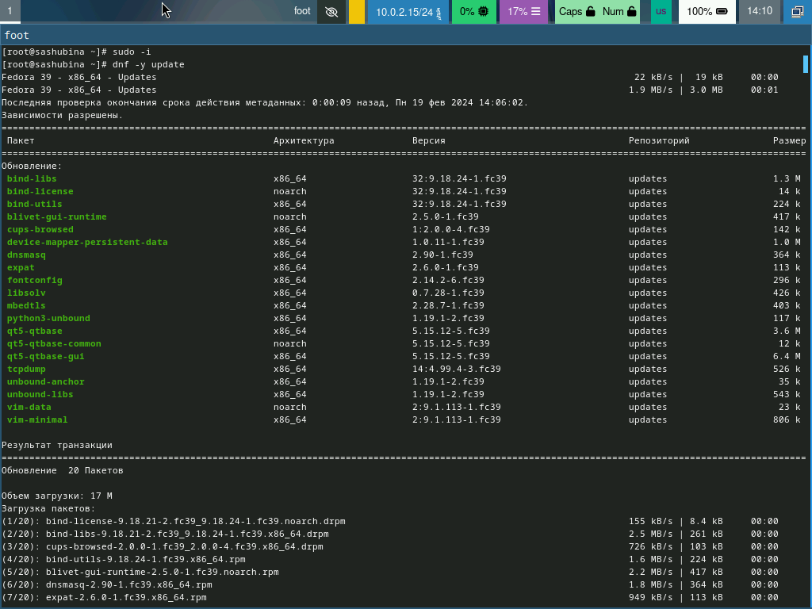{#fig:001 width=70%}

Повышение комфорта работы
Программы для удобства работы в консоли:
dnf -y install tmux mc
(рис. [-@fig:002])

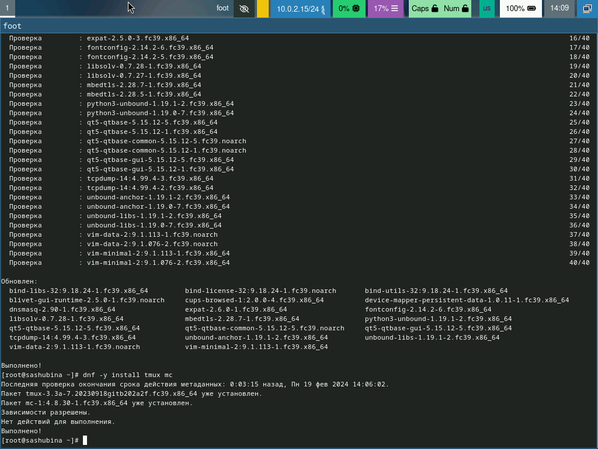{#fig:002 width=70%}

Автоматическое обновление
При необходимости можно использовать автоматическое обновление.

Установка программного обеспечения:
dnf install dnf-automatic
(рис. [-@fig:003])

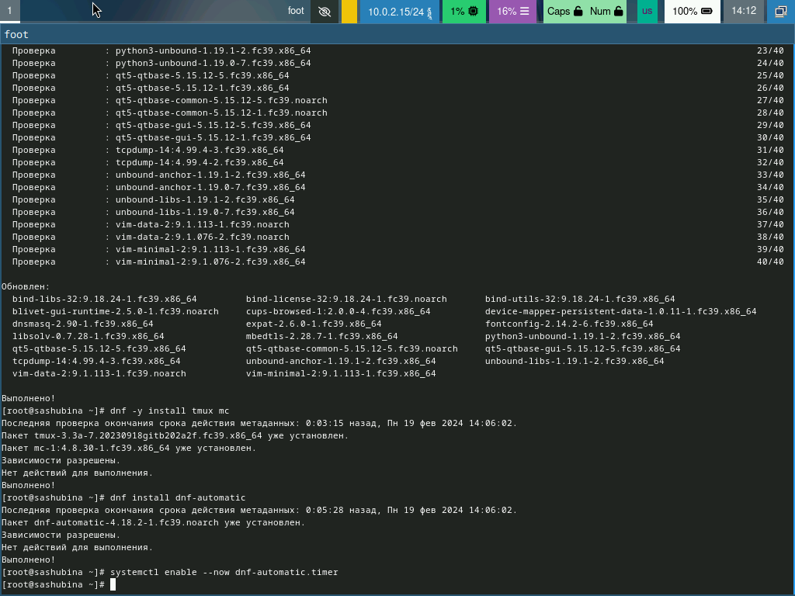{#fig:003 width=70%}

Зададим необходимую конфигурацию в файле /etc/dnf/automatic.conf.
Запустим таймер:
systemctl enable --now dnf-automatic.timer
Отключение SELinux
В данном курсе мы не будем рассматривать работу с системой безопасности SELinux.
Поэтому отключим его.
В файле /etc/selinux/config заменим значение
SELINUX=enforcing
на значение
SELINUX=permissive
(рис. [-@fig:004])

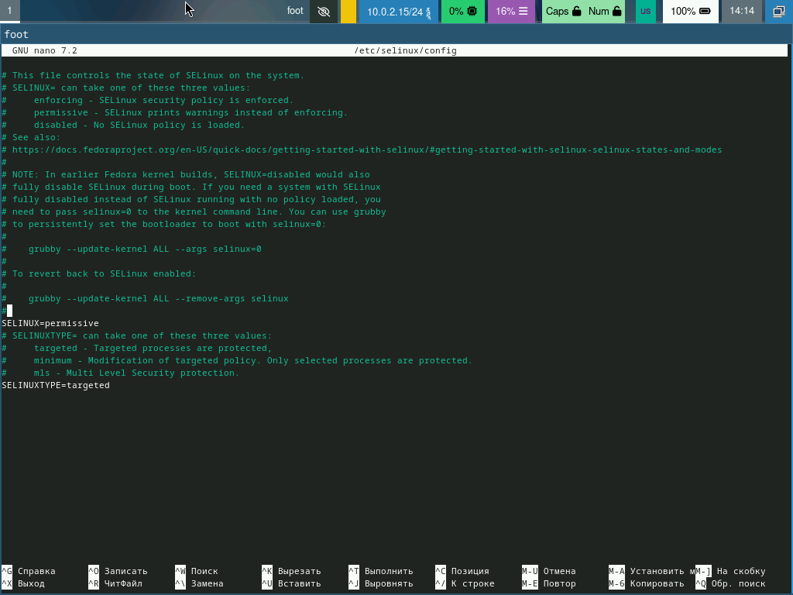{#fig:004 width=70%}

Перегрузим виртуальную машину:
Установка драйверов для VirtualBox
Войдем в ОС под заданной нами при установке учётной записью.
Нажмем комбинацию Win+Enter для запуска терминала.

Запустим терминальный мультиплексор tmux:
tmux
Переключитесь на роль супер-пользователя:
sudo -i
Установим средства разработки:
dnf -y group install "Development Tools"
(рис. [-@fig:005])

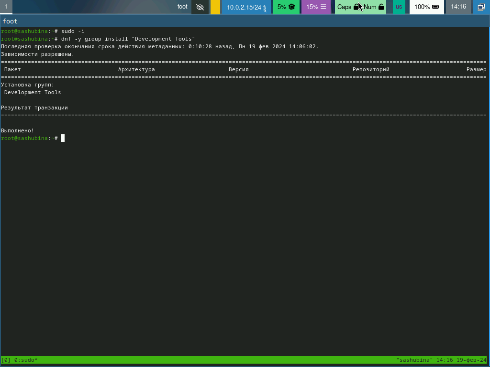{#fig:005 width=70%}

Установим пакет DKMS:
dnf -y install dkms
В меню виртуальной машины подключим образ диска дополнений гостевой ОС.
Подмонтируем диск:
mount /dev/sr0 /media
Установим драйвера:
/media/VBoxLinuxAdditions.run
Перегрузим виртуальную машину:
reboot
(рис. [-@fig:006])

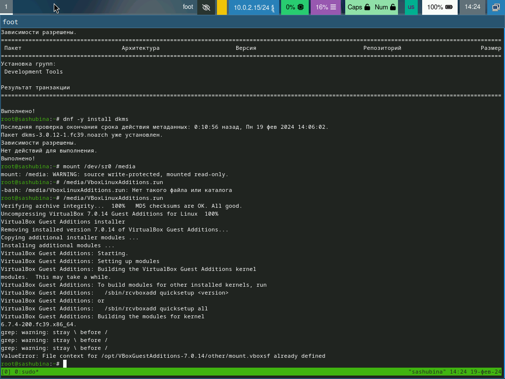{#fig:006 width=70%}

Настройка раскладки клавиатуры
Войдем в ОС под заданной нами при установке учётной записью.
Нажмем комбинацию Win+Enter для запуска терминала.
Запустим терминальный мультиплексор tmux:
tmux
Создадим конфигурационный файл ~/.config/sway/config.d/95-system-keyboard-config.conf:
touch ~/.config/sway/config.d/95-system-keyboard-config.conf
Отредактируем конфигурационный файл ~/.config/sway/config.d/95-system-keyboard-config.conf:
exec_always /usr/libexec/sway-systemd/locale1-xkb-config --oneshot
Переключимся на роль супер-пользователя:
sudo -i
(рис. [-@fig:007])

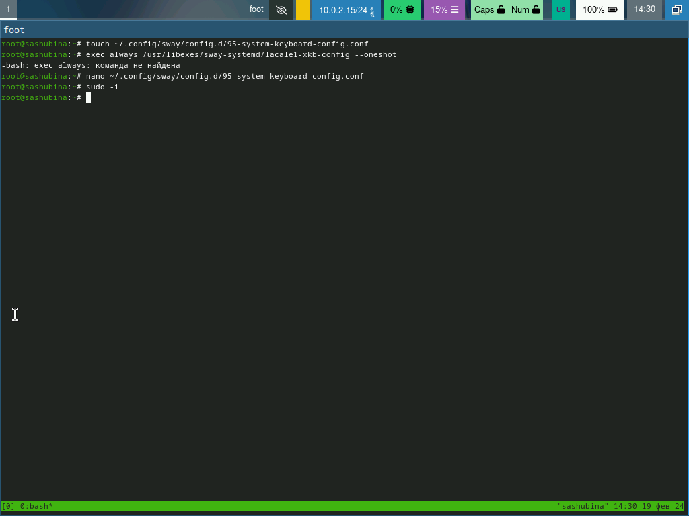{#fig:007 width=70%}

Отредактируем конфигурационный файл /etc/X11/xorg.conf.d/00-keyboard.conf:
Section "InputClass"
```
Identifier "system-keyboard"
MatchIsKeyboard "on"
Option "XkbLayout" "us,ru"
Option "XkbVariant" ",winkeys"
Option "XkbOptions" "grp:rctrl_toggle,compose:ralt,terminate:ctrl_alt_bksp"
```
(рис. [-@fig:008])

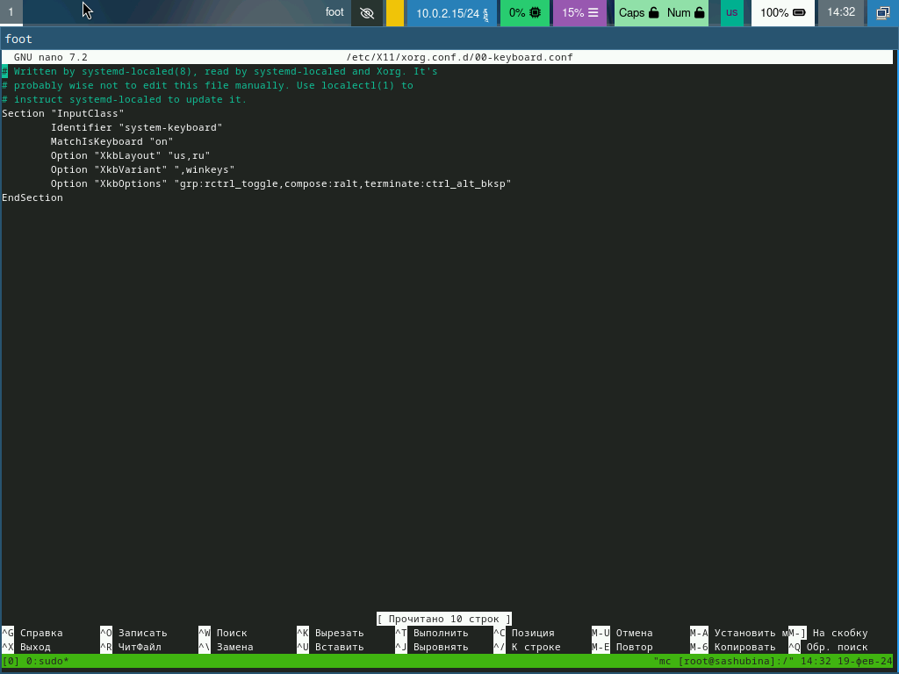{#fig:008 width=70%}

Для этого можно использовать файловый менеджер mc и его встроенный редактор.
Перегрузим виртуальную машину:
reboot

Установка имени пользователя и названия хоста
Если при установке виртуальной машины вы задали имя пользователя или имя хоста, не удовлетворяющее соглашению об именовании, то вам необходимо исправить это.
Запустим виртуальную машину и залогинемся.
Нажмите комбинацию Win+Enter для запуска терминала.

Запустим терминальный мультиплексор tmux:
tmux
Переключимся на роль супер-пользователя:
sudo -i
Создадим пользователя (вместо username укажите ваш логин в дисплейном классе):
adduser -G wheel username
Зададим пароль для пользователя (вместо username укажите ваш логин в дисплейном классе):
passwd username
Установим имя хоста (вместо username укажите ваш логин в дисплейном классе):
hostnamectl set-hostname username
Проверим, что имя хоста установлено верно:
hostnamectl
(рис. [-@fig:009])

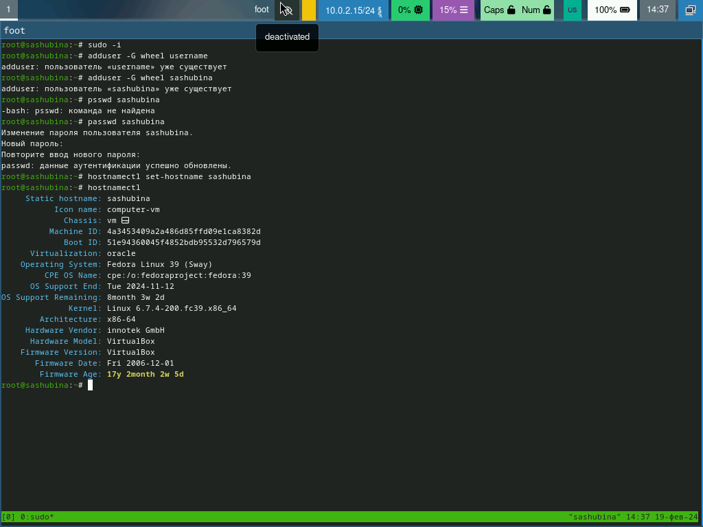{#fig:009 width=70%}

Подключение общей папки
Внутри виртуальной машины добавим своего пользователя в группу vboxsf (вместо username укажите ваш логин):
gpasswd -a username vboxsf
В хостовой системе подключим разделяемую папку:
vboxmanage sharedfolder add "$(id -un)_os-intro" --name=work --hostpath=work --automount
Перегрузим виртуальную машину:
reboot
Папка будет монтироваться в /media/sf_work.
Установка программного обеспечения для создания документации
Нажмем комбинацию Win+Enter для запуска терминала.
Запустим терминальный мультиплексор tmux:
tmux
Переключимся на роль супер-пользователя:
sudo -i
(рис. [-@fig:010])

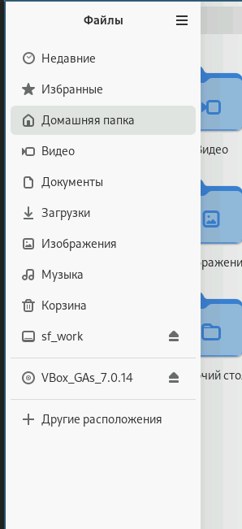{#fig:010 width=70%}

Работа с языком разметки Markdown
Средство pandoc для работы с языком разметки Markdown.

Установка с помощью менеджера пакетов:
dnf -y install pandoc
Для работы с перекрёстными ссылками мы используем пакет pandoc-crossref.
Лучше установить pandoc и pandoc-crossref вручную.
(рис. [-@fig:011])

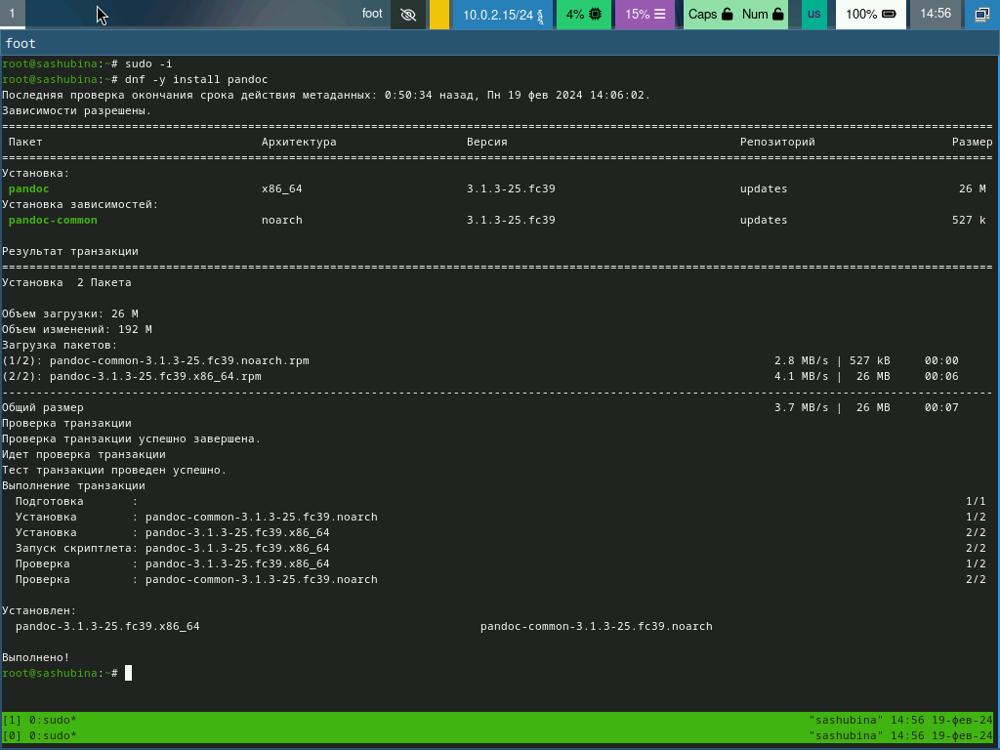{#fig:011 width=70%}
 
texlive
Установим дистрибутив TeXlive:
dnf -y install texlive-scheme-ful
(рис. [-@fig:014])

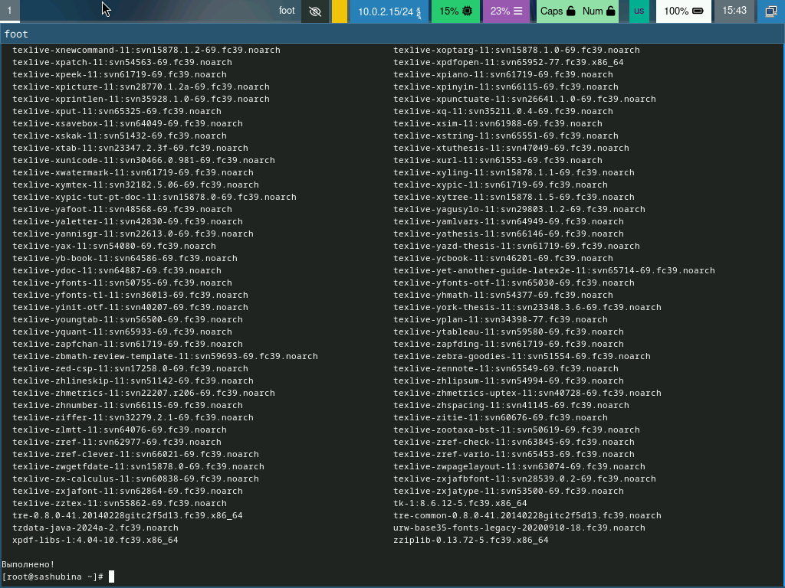{#fig:012 width=70%}

#Домашнее задание

Дождемся загрузки графического окружения и откройте терминал. В окне терминала проанализируем последовательность загрузки системы, выполнив команду dmesg. Можно просто просмотреть вывод этой команды:
dmesg | less
Можно использовать поиск с помощью grep:
dmesg | grep -i "то, что ищем"
Получим следующую информацию.
Версия ядра Linux (Linux version).
Частота процессора (Detected Mhz processor).
Модель процессора (CPU0).
Объём доступной оперативной памяти (Memory available).
Тип обнаруженного гипервизора (Hypervisor detected).
Тип файловой системы корневого раздела.
Последовательность монтирования файловых систем.

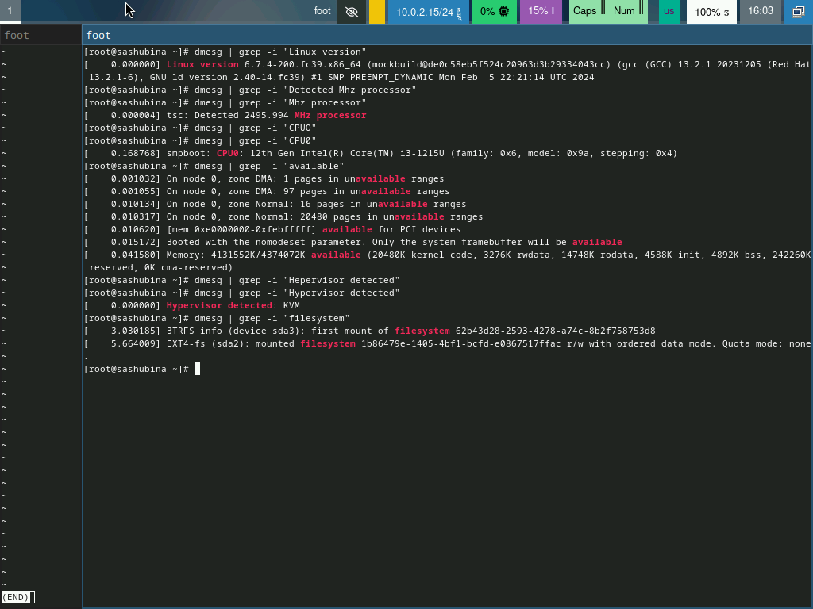{#fig:013 width=70%}


# Выводы

Я приобрела практические навыки для установки операционной системы на виртуальную машину,навыки,минимально необходимые, для дальнейшей работы сервера.

# Список литературы{.unnumbered}

::: {#refs}
:::
