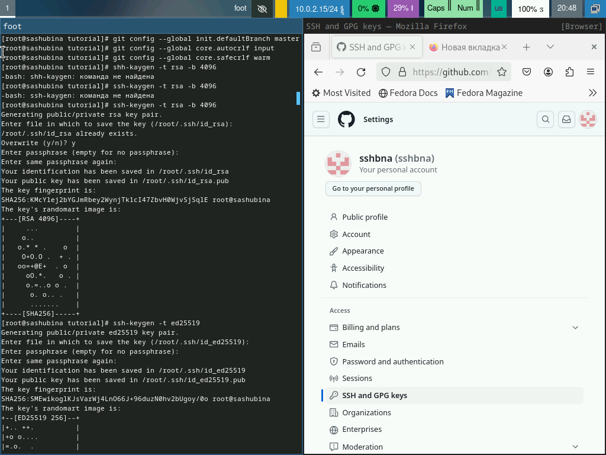
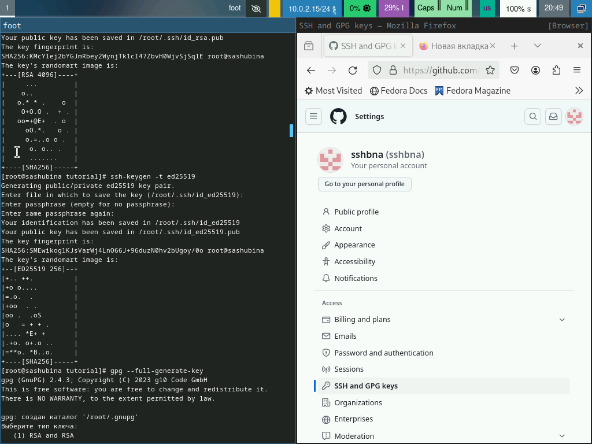
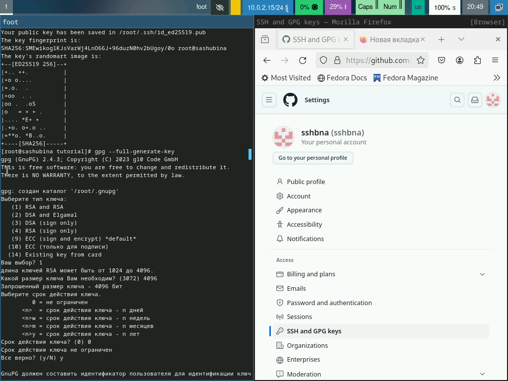
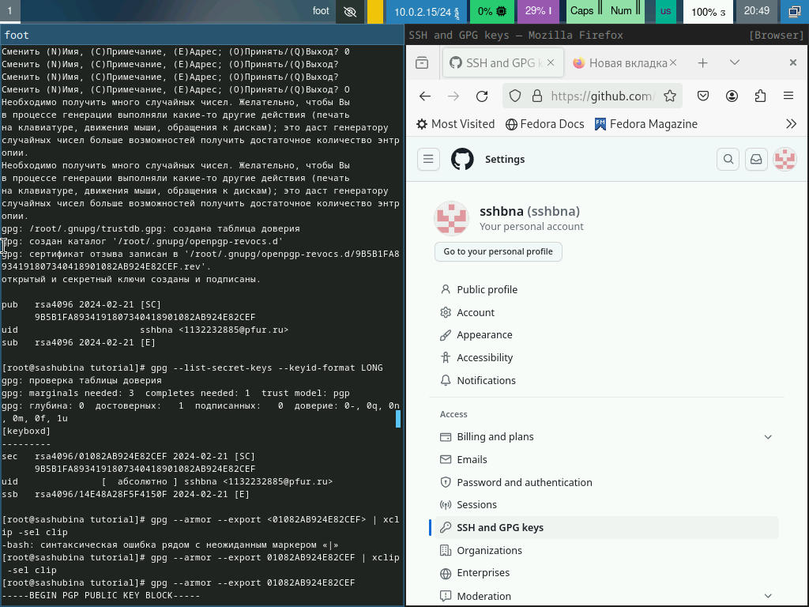
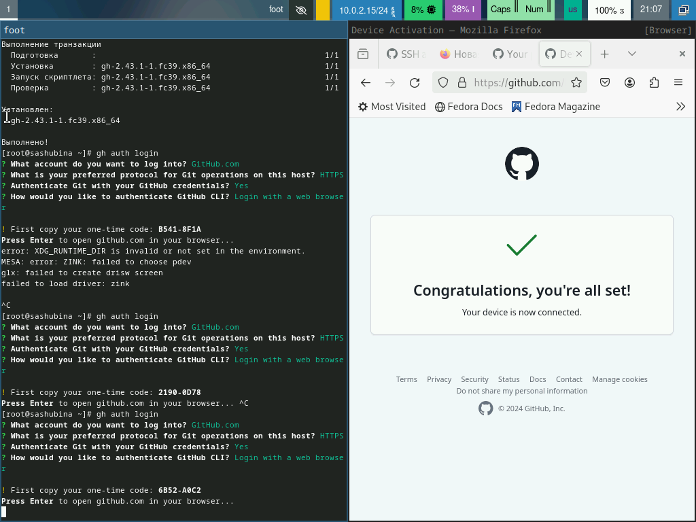
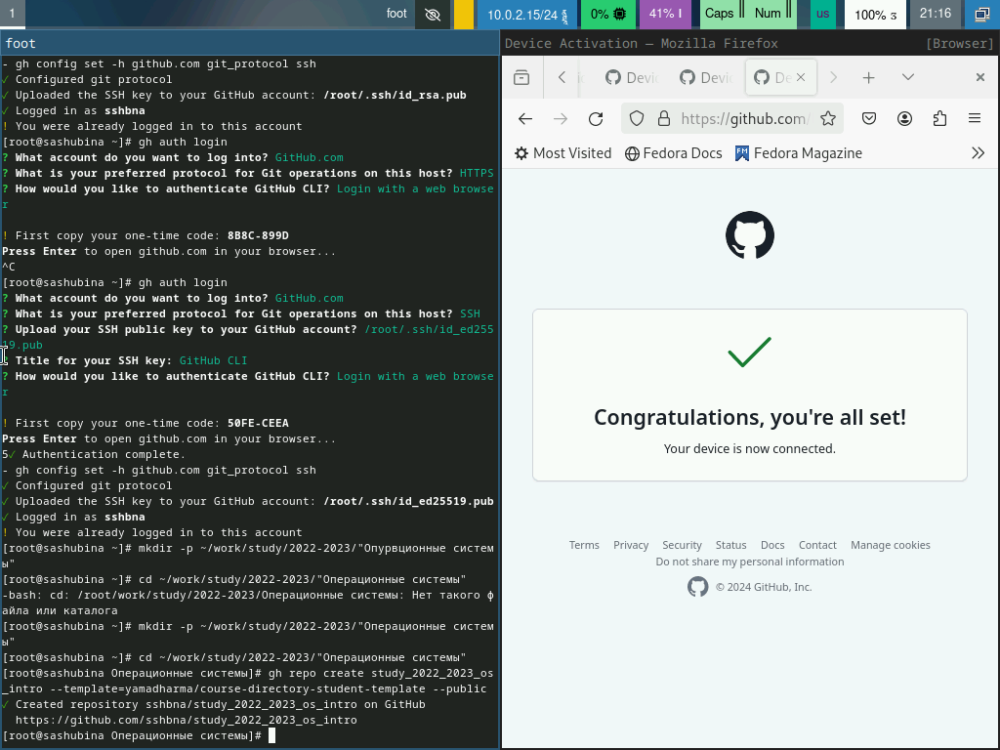
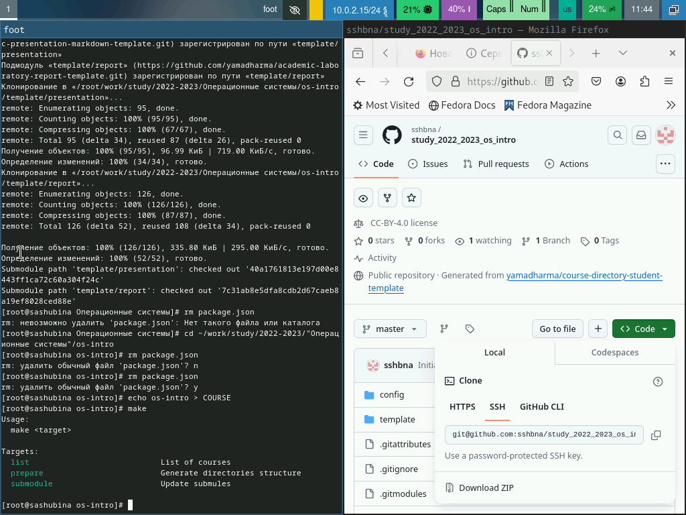
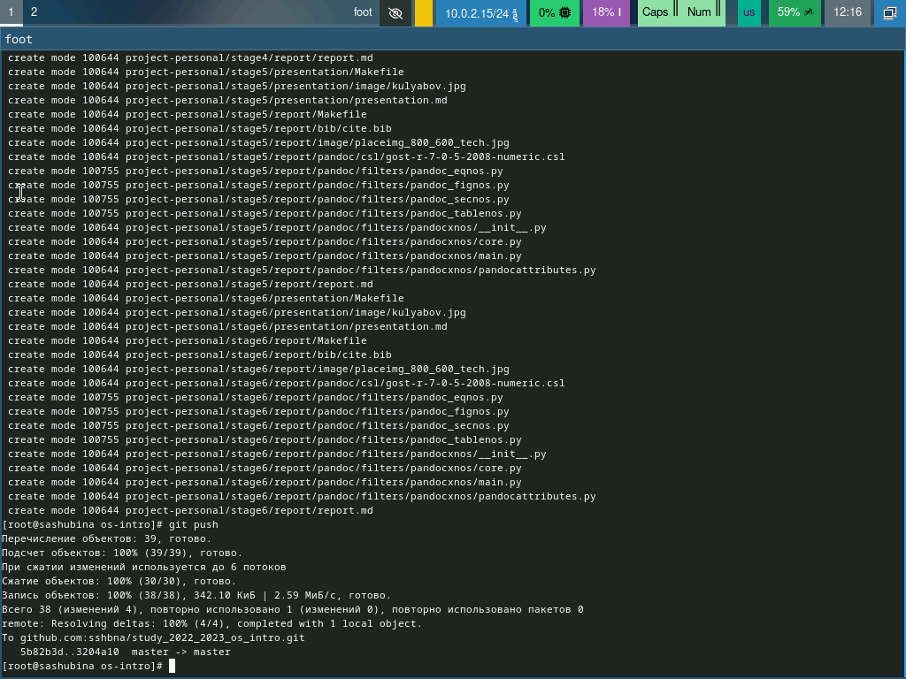

---
## Front matter
title: "Отчет по лабораторной работе №3"
author: "Шубина София Антоновна"

## Generic otions
lang: ru-RU
toc-title: "Содержание"

## Bibliography
bibliography: bib/cite.bib
csl: pandoc/csl/gost-r-7-0-5-2008-numeric.csl

## Pdf output format
toc: true # Table of contents
toc-depth: 2
lof: true # List of figures
lot: true # List of tables
fontsize: 12pt
linestretch: 1.5
papersize: a4
documentclass: scrreprt
## I18n polyglossia
polyglossia-lang:
  name: russian
  options:
	- spelling=modern
	- babelshorthands=true
polyglossia-otherlangs:
  name: english
## I18n babel
babel-lang: russian
babel-otherlangs: english
## Fonts
mainfont: PT Serif
romanfont: PT Serif
sansfont: PT Sans
monofont: PT Mono
mainfontoptions: Ligatures=TeX
romanfontoptions: Ligatures=TeX
sansfontoptions: Ligatures=TeX,Scale=MatchLowercase
monofontoptions: Scale=MatchLowercase,Scale=0.9
## Biblatex
biblatex: true
biblio-style: "gost-numeric"
biblatexoptions:
  - parentracker=true
  - backend=biber
  - hyperref=auto
  - language=auto
  - autolang=other*
  - citestyle=gost-numeric
## Pandoc-crossref LaTeX customization
figureTitle: "Рис."
tableTitle: "Таблица"
listingTitle: "Листинг"
lofTitle: "Список иллюстраций"
lotTitle: "Список таблиц"
lolTitle: "Листинги"
## Misc options
indent: true
header-includes:
  - \usepackage{indentfirst}
  - \usepackage{float} # keep figures where there are in the text
  - \floatplacement{figure}{H} # keep figures where there are in the text
---

# Цель работы
Изучить идеологию и применение средств контроля версий.
Освоить умения по работе с git

# Теоретическое введение
Системы контроля версий. Общие понятия

Системы контроля версий (Version Control System, VCS) применяются при работе нескольких человек над одним проектом. Обычно основное дерево проекта хранится в локальном или удалённом репозитории, к которому настроен доступ для участников проекта. При внесении изменений в содержание проекта система контроля версий позволяет их фиксировать, совмещать изменения, произведённые разными участниками проекта, производить откат к любой более ранней версии проекта, если это требуется.
В классических системах контроля версий используется централизованная модель, предполагающая наличие единого репозитория для хранения файлов. Выполнение большинства функций по управлению версиями осуществляется специальным сервером. Участник проекта (пользователь) перед началом работы посредством определённых команд получает нужную ему версию файлов. После внесения изменений, пользователь размещает новую версию в хранилище. При этом предыдущие версии не удаляются из центрального хранилища и к ним можно вернуться в любой момент. Сервер может сохранять не полную версию изменённых файлов, а производить так называемую дельта-компрессию — сохранять только изменения между последовательными версиями, что позволяет уменьшить объём хранимых данных.
Системы контроля версий поддерживают возможность отслеживания и разрешения конфликтов, которые могут возникнуть при работе нескольких человек над одним файлом. Можно объединить (слить) изменения, сделанные разными участниками (автоматически или вручную), вручную выбрать нужную версию, отменить изменения вовсе или заблокировать файлы для изменения. В зависимости от настроек блокировка не позволяет другим пользователям получить рабочую копию или препятствует изменению рабочей копии файла средствами файловой системы ОС, обеспечивая таким образом, привилегированный доступ только одному пользователю, работающему с файлом.
Системы контроля версий также могут обеспечивать дополнительные, более гибкие функциональные возможности. Например, они могут поддерживать работу с несколькими версиями одного файла, сохраняя общую историю изменений до точки ветвления версий и собственные истории изменений каждой ветви. Кроме того, обычно доступна информация о том, кто из участников, когда и какие изменения вносил. Обычно такого рода информация хранится в журнале изменений, доступ к которому можно ограничить.
В отличие от классических, в распределённых системах контроля версий центральный репозиторий не является обязательным.
Среди классических VCS наиболее известны CVS, Subversion, а среди распределённых — Git, Bazaar, Mercurial. Принципы их работы схожи, отличаются они в основном синтаксисом используемых в работе команд.
[@tuis_rudn]

# Выполнение лабораторной работы
Базовая настройка git
Зададим имя и email владельца репозитория:
git config --global user.name "Name Surname"
git config --global user.email "work@mail"
Настроим utf-8 в выводе сообщений git:
git config --global core.quotepath false

(рис. [-@fig:001]).
{#fig:001 width=70%}

Настроим верификацию и подписание коммитов git (см. Верификация коммитов git с помощью GPG).
Зададим имя начальной ветки (будем называть её master):
git config --global init.defaultBranch master
Параметр autocrlf:
git config --global core.autocrlf input
Параметр safecrlf:
git config --global core.safecrlf warn
Создадим ключи ssh
по алгоритму rsa с ключём размером 4096 бит:
ssh-keygen -t rsa -b 4096
по алгоритму ed25519:
ssh-keygen -t ed25519

(рис. [-@fig:002]).
{#fig:002 width=70%}

Создайте ключи pgp
Генерируем ключ
gpg --full-generate-key

(рис. [-@fig:003]).
{#fig:003 width=70%}

Из предложенных опций выбираем:
тип RSA and RSA;
размер 4096;
выберем срок действия; значение по умолчанию — 0 (срок действия не истекает никогда).
GPG запросит личную информацию, которая сохранится в ключе:
Имя (не менее 5 символов).
Адрес электронной почты.
При вводе email убедимся, что он соответствует адресу, используемому на GitHub.
Комментарий. Можно ввести что угодно или нажать клавишу ввода, чтобы оставить это поле пустым.

(рис. [-@fig:004]).
{#fig:004 width=70%}

Настройка github
Создадим учётную запись на https://github.com.
Заполним основные данные на https://github.com.

Добавление PGP ключа в GitHub
Выводим список ключей и копируем отпечаток приватного ключа:
gpg --list-secret-keys --keyid-format LONG
Отпечаток ключа — это последовательность байтов, используемая для идентификации более длинного, по сравнению с самим отпечатком ключа.
Формат строки:
sec   Алгоритм/Отпечаток_ключа Дата_создания 
ID_ключа
Cкопируйте ваш сгенерированный PGP ключ в буфер обмена:
gpg --armor --export <PGP Fingerprint> | xclip -sel clip
Перейдем в настройки GitHub (https://github.com/settings/keys), нажмtv на кнопку New GPG key и вставbv полученный ключ в поле ввода.

(рис. [-@fig:005]).
{#fig:005 width=70%}

Настройка автоматических подписей коммитов git
Используя введёный email, укажtv Git применять его при подписи коммитов:
git config --global user.signingkey <PGP Fingerprint>
git config --global commit.gpgsign true
git config --global gpg.program $(which gpg2)
Настройка gh
Для начала необходимо авторизоваться
gh auth login
Утилита задаст несколько наводящих вопросов.
Авторизоваться можно через броузер.

(рис. [-@fig:006]).
{#fig:006 width=70%}

Сознание репозитория курса на основе шаблона
Необходимо создать шаблон рабочего пространства (см. Рабочее пространство для лабораторной работы).
Например, для 2022–2023 учебного года и предмета «Операционные системы» (код предмета os-intro) создание репозитория примет следующий вид:
mkdir -p ~/work/study/2022-2023/"Операционные системы"
cd ~/work/study/2022-2023/"Операционные системы"
gh repo create study_2022-2023_os-intro --template=yamadharma/course-directory-student-template --public
git clone --recursive git@github.com:<owner>/study_2022-2023_os-intro.git os-intro

(рис. [-@fig:007]).
{#fig:007 width=70%}

Настройка каталога курса
Перейдем в каталог курса:
cd ~/work/study/2022-2023/"Операционные системы"/os-intro

Удалим лишние файлы:
rm package.json

Создадим обходимые каталоги:
echo os-intro > COURSE
make

(рис. [-@fig:008]).
{#fig:008 width=70%}

Отправим файлы на сервер:
git add .
git commit -am 'feat(main): make course structure'
git push

(рис. [-@fig:009]).
{#fig:009 width=70%}

# Контрольные вопросы
1. Системы контроля версий (VCS) - это инструменты, предназначенные для отслеживания изменений в файлах и работе с версиями кода или других файлов. Они предназначены для решения задач управления версиями файлов, отслеживания изменений, совместной работы над проектами, восстановления предыдущих версий и контролирования доступа.
2. 
- Хранилище (repository) - это место, где хранятся все версии файлов и история изменений.
- Commit - фиксация изменений в хранилище, создание новой версии с описанием изменений.
- История (history) - список всех коммитов, изменений и версий файла или проекта.
- Рабочая копия (working copy) - копия файлов из хранилища, с которой работает пользователь.
3. Централизованные VCS имеют единственный центральный репозиторий, куда все коммиты отправляются и откуда пользователи могут получать обновления. Децентрализованные VCS позволяют каждому пользователю иметь локальную копию репозитория и работать независимо, с возможностью обмена изменениями. Примеры: централизованный - SVN, децентрализованный - Git.
4. При единоличной работе с хранилищем VCS пользователь будет делать изменения в своей локальной копии, коммитить их в свой репозиторий без необходимости синхронизации с другими пользователями.
5. Порядок работы с общим хранилищем VCS включает получение изменений (pull), отправку изменений (push), коммиты (commit), работу с различными ветками и управление конфликтами.
6. Основные задачи Git: отслеживание изменений, совместная работа над проектами, управление ветками, восстановление предыдущих версий, контроль доступа и другие.
7. Некоторые основные команды Git:
   - git init: создание нового репозитория.
   - git add: добавление файлов в индекс.
   - git commit: фиксация изменений.
   - git push: отправка изменений на удаленный репозиторий.
   - git pull: получение изменений с удаленного репозитория.
8. Пример использования Git:
   - Локальный репозиторий: коммит изменений, создание веток, слияние веток.
   - Удаленный репозиторий: отправка изменений (push), получение изменений (pull), работа с общим кодом.
9. Ветви (branches) в Git позволяют работать параллельно над разными версиями проекта, разрабатывать новые функции или исправлять ошибки, не влияя на основной код.
10. Игнорирование файлов в Git позволяет исключить определенные файлы или каталоги из области видимости VCS, чтобы они не попадали в коммиты. Это делается с помощью файла .gitignore, который содержит шаблоны игнорируемых файлов.
# Выводы
Я изучила идеологию и применила средства контроля версий,освоила умения по работе с git.

# Список литературы{.unnumbered}

::: {#refs}
:::
