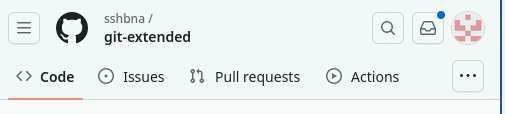
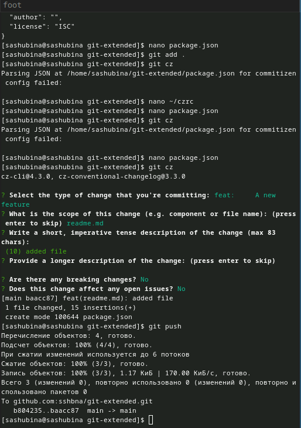
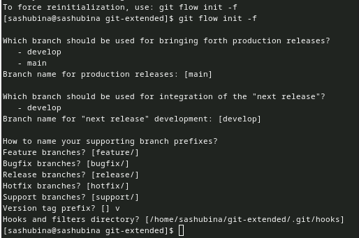
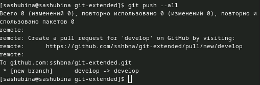

---
## Front matter
lang: ru-RU
title: Структура научной презентации
subtitle: 
author:
  - Шубина С.А.
institute:
  - Российский университет дружбы народов, Москва, Россия
date: 04 марта 2024

## i18n babel
babel-lang: russian
babel-otherlangs: english

## Formatting pdf
toc: false
toc-title: Содержание
slide_level: 2
aspectratio: 169
section-titles: true
theme: metropolis
header-includes:
 - \metroset{progressbar=frametitle,sectionpage=progressbar,numbering=fraction}
 - '\makeatletter'
 - '\beamer@ignorenonframefalse'
 - '\makeatother'
## Fonts
mainfont: PT Serif
romanfont: PT Serif
sansfont: PT Sans
monofont: PT Mono
mainfontoptions: Ligatures=TeX
romanfontoptions: Ligatures=TeX
sansfontoptions: Ligatures=TeX,Scale=MatchLowercase
monofontoptions: Scale=MatchLowercase,Scale=0.9
---

# Информация

## Докладчик

:::::::::::::: {.columns align=center}
::: {.column width="70%"}

  * Шубина София Антоновна
  * Студентка, НПИбд-02-23
  * факультет физико-математических и естественных наук, направление прикладная информатиика
  * Российский университет дружбы народов
  * [1132232885@pfur.ru](mailto:1132232885@pfur.ru)

:::
::: {.column width="30%"}
:::
::::::::::::::

## Цель работы
Получение навыков правильной работы с репозиториями git.

## Задание
Здесь приводится описание задания в соответствии с рекомендациями
методического пособия и выданным вариантом.

## Теоретическое введение
Рабочий процесс Gitflow Workflow. Будем описывать его с использованием пакета git-flow

## Выполнение лабораторной работы

## Установка программного обеспечения
Установка git-flow
Linux
Fedora
Установка из коллекции репозиториев Copr (https://copr.fedorainfracloud.org/coprs/elegos/gitflow/):
 # Enable the copr repository
dnf copr enable elegos/gitflow
 # Install gitflow
dnf install gitflow

{.column width="30%"}

## Установка Node.js
На Node.js базируется программное обеспечение для семантического версионирования и общепринятых коммитов.
Fedora
dnf install nodejs
apt-get install pnpm

{.column width="30%"}

## Настройка Node.js
Для работы с Node.js добавим каталог с исполняемыми файлами, устанавливаемыми yarn, в переменную PATH.
Запустим:
pnpm setup

{.column width="30%"}

## Перелогинемся или выполним:
source ~/.bashrc
Общепринятые коммиты
commitizen
Данная программа используется для помощи в форматировании коммитов.
pnpm add -g commitizen
При этом устанавливается скрипт git-cz, который мы и будем использовать для коммитов.

{.column width="30%"}

## standard-changelog
Данная программа используется для помощи в создании логов.
pnpm add -g standard-changelog

{.column width="30%"}

## Практический сценарий использования git
Создание репозитория git
Подключение репозитория к github
Создадим репозиторий на GitHub. Для примера назовём его git-extended.

{.column width="30%"}

## Делаем первый коммит и выкладываем на github:
Для начала клонируем репозиторий

{.column width="30%"}

## git commit -m "first commit"
git remote add origin git@github.com:<username>/git-extended.git
git push -u origin master

{.column width="30%"}

## Конфигурация общепринятых коммитов
Конфигурация для пакетов Node.js
pnpm init

{.column width="30%"}

## Необходимо заполнить несколько параметров пакета.
Название пакета.
Лицензия пакета. Список лицензий для npm: https://spdx.org/licenses/. Предлагается выбирать лицензию CC-BY-4.0.
Сконфигурим формат коммитов. Для этого добавим в файл package.json команду для формирования коммитов:
"config": {
"commitizen": {
 "path": "cz-conventional-changelog"
 }
}
## Таким образом, файл package.json приобретает вид:
{
"name": "git-extended",
 "version": "1.0.0",
"description": "Git repo for educational purposes",
"main": "index.js",
"repository": "git@github.com:username/git-extended.git",
"author": "Name Surname <username@gmail.com>",
"license": "CC-BY-4.0",
 "config": {
"commitizen": {
 "path": "cz-conventional-changelog"
}
}
}

{.column width="30%"}

## Добавим новые файлы:
git add .
Выполним коммит:
git cz
Отправим на github:
git push

{.column width="30%"}

## Конфигурация git-flow
Инициализируем git-flow
git flow init
Префикс для ярлыков установим в v.

{.column width="30%"}

## Проверьте, что Вы на ветке develop:
git branch

{.column width="30%"}

## Загрузите весь репозиторий в хранилище:
git push --all

{.column width="30%"}

## Установим внешнюю ветку как вышестоящую для этой ветки:
git branch --set-upstream-to=origin/develop develop
Cоздадим релиз с версией 1.0.0
git flow release start 1.0.0

{.column width="30%"}

## Создадим журнал изменений
standard-changelog --first-release
Добавим журнал изменений в индекс
git add CHANGELOG.md
git commit -am 'chore(site): add changelog'
{.column width="30%"}

{.column width="30%"}

## Зальём релизную ветку в основную ветку
git flow release finish 1.0.0
Отправим данные на github
git push --all
git push --tags

{.column width="30%"}

## Создадим релиз на github. Для этого будем использовать утилиты работы с github:
gh release create v1.0.0 -F CHANGELOG.md
Работа с репозиторием git
Разработка новой функциональности
Создадим ветку для новой функциональности:
git flow feature start feature_branch
Далее, продолжаем работу c git как обычно.
По окончании разработки новой функциональности следующим шагом следует объединить ветку feature_branch c develop:
git flow feature finish feature_branch

Создание релиза git-flow
Создадим релиз с версией 1.2.3:
git flow release start 1.2.3
Обновите номер версии в файле package.json. Установите её в 1.2.3.

{.column width="30%"}

## Создадим журнал изменений
standard-changelog
Добавим журнал изменений в индекс
git add CHANGELOG.md
git commit -am 'chore(site): update changelog'
Зальём релизную ветку в основную ветку
git flow release finish 1.2.3

## Отправим данные на github
git push --all
git push --tags
Создадим релиз на github с комментарием из журнала изменений:
gh release create v1.2.3 -F CHANGELOG.md

{.column width="30%"}

# Выводы

Я получила правильные навыки работы с репозиториями git.

