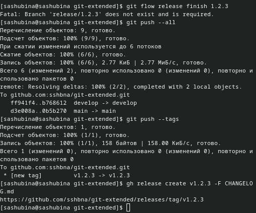

---
## Front matter
title: "Отчет по лабораторной работе №4"
author: "Шубина София Антоновна"

## Generic otions
lang: ru-RU
toc-title: "Содержание"

## Bibliography
bibliography: bib/cite.bib
csl: pandoc/csl/gost-r-7-0-5-2008-numeric.csl

## Pdf output format
toc: true # Table of contents
toc-depth: 2
lof: true # List of figures
lot: true # List of tables
fontsize: 12pt
linestretch: 1.5
papersize: a4
documentclass: scrreprt
## I18n polyglossia
polyglossia-lang:
  name: russian
  options:
	- spelling=modern
	- babelshorthands=true
polyglossia-otherlangs:
  name: english
## I18n babel
babel-lang: russian
babel-otherlangs: english
## Fonts
mainfont: PT Serif
romanfont: PT Serif
sansfont: PT Sans
monofont: PT Mono
mainfontoptions: Ligatures=TeX
romanfontoptions: Ligatures=TeX
sansfontoptions: Ligatures=TeX,Scale=MatchLowercase
monofontoptions: Scale=MatchLowercase,Scale=0.9
## Biblatex
biblatex: true
biblio-style: "gost-numeric"
biblatexoptions:
  - parentracker=true
  - backend=biber
  - hyperref=auto
  - language=auto
  - autolang=other*
  - citestyle=gost-numeric
## Pandoc-crossref LaTeX customization
figureTitle: "Рис."
tableTitle: "Таблица"
listingTitle: "Листинг"
lofTitle: "Список иллюстраций"
lotTitle: "Список таблиц"
lolTitle: "Листинги"
## Misc options
indent: true
header-includes:
  - \usepackage{indentfirst}
  - \usepackage{float} # keep figures where there are in the text
  - \floatplacement{figure}{H} # keep figures where there are in the text
---

# Цель работы
Получение навыков правильной работы с репозиториями git.

# Задание
Здесь приводится описание задания в соответствии с рекомендациями
методического пособия и выданным вариантом.

# Теоретическое введение
Рабочий процесс Gitflow Workflow. Будем описывать его с использованием пакета git-flow
[@tuis_rudn]

# Выполнение лабораторной работы
Установка программного обеспечения
Установка git-flow
Linux
Fedora
Установка из коллекции репозиториев Copr (https://copr.fedorainfracloud.org/coprs/elegos/gitflow/):
 # Enable the copr repository
dnf copr enable elegos/gitflow
 # Install gitflow
dnf install gitflow
(рис. [-@fig:001]).

{#fig:001 width=70%}

Установка Node.js
На Node.js базируется программное обеспечение для семантического версионирования и общепринятых коммитов.
Fedora
dnf install nodejs
apt-get install pnpm
(рис. [-@fig:002]).

{#fig:002 width=70%}

Настройка Node.js
Для работы с Node.js добавим каталог с исполняемыми файлами, устанавливаемыми yarn, в переменную PATH.
Запустим:
pnpm setup
(рис. [-@fig:003]).

{#fig:003 width=70%}

Перелогинемся или выполним:
source ~/.bashrc

Общепринятые коммиты
commitizen
Данная программа используется для помощи в форматировании коммитов.
pnpm add -g commitizen
При этом устанавливается скрипт git-cz, который мы и будем использовать для коммитов.
(рис. [-@fig:004]).

{#fig:004 width=70%}

standard-changelog
Данная программа используется для помощи в создании логов.
pnpm add -g standard-changelog
(рис. [-@fig:005]).

{#fig:005 width=70%}

Практический сценарий использования git
Создание репозитория git
Подключение репозитория к github
Создадим репозиторий на GitHub. Для примера назовём его git-extended.
(рис. [-@fig:006]).

{#fig:006 width=70%}

Делаем первый коммит и выкладываем на github:
Для начала клонируем репозиторий
(рис. [-@fig:007]).

{#fig:007 width=70%}

git commit -m "first commit"
git remote add origin git@github.com:<username>/git-extended.git
git push -u origin master
(рис. [-@fig:008]).

{#fig:008 width=70%}

Конфигурация общепринятых коммитов
Конфигурация для пакетов Node.js
pnpm init
(рис. [-@fig:009]).

{#fig:009 width=70%}

Необходимо заполнить несколько параметров пакета.
Название пакета.
Лицензия пакета. Список лицензий для npm: https://spdx.org/licenses/. Предлагается выбирать лицензию CC-BY-4.0.
Сконфигурим формат коммитов. Для этого добавим в файл package.json команду для формирования коммитов:
"config": {
"commitizen": {
 "path": "cz-conventional-changelog"
 }
}
Таким образом, файл package.json приобретает вид:
{
"name": "git-extended",
 "version": "1.0.0",
"description": "Git repo for educational purposes",
"main": "index.js",
"repository": "git@github.com:username/git-extended.git",
"author": "Name Surname <username@gmail.com>",
"license": "CC-BY-4.0",
 "config": {
"commitizen": {
 "path": "cz-conventional-changelog"
}
}
}
(рис. [-@fig:010]).

{#fig:010 width=70%}

Добавим новые файлы:
git add .
Выполним коммит:
git cz
Отправим на github:
git push
(рис. [-@fig:011]).

{#fig:011 width=70%}

Конфигурация git-flow
Инициализируем git-flow
git flow init
Префикс для ярлыков установим в v.
(рис. [-@fig:012]).

{#fig:012 width=70%}

Проверьте, что Вы на ветке develop:
git branch
(рис. [-@fig:013]).

{#fig:013 width=70%}

Загрузите весь репозиторий в хранилище:
git push --all
(рис. [-@fig:014]).

{#fig:014 width=70%}

Установим внешнюю ветку как вышестоящую для этой ветки:
git branch --set-upstream-to=origin/develop develop
Cоздадим релиз с версией 1.0.0
git flow release start 1.0.0
(рис. [-@fig:015]).

{#fig:015 width=70%}

Создадим журнал изменений
standard-changelog --first-release
Добавим журнал изменений в индекс
git add CHANGELOG.md
git commit -am 'chore(site): add changelog'
(рис. [-@fig:016]).

{#fig:016 width=70%}

Зальём релизную ветку в основную ветку
git flow release finish 1.0.0
Отправим данные на github
git push --all
git push --tags
(рис. [-@fig:017]).

{#fig:017 width=70%}

Создадим релиз на github. Для этого будем использовать утилиты работы с github:
gh release create v1.0.0 -F CHANGELOG.md
Работа с репозиторием git
Разработка новой функциональности
Создадим ветку для новой функциональности:
git flow feature start feature_branch
Далее, продолжаем работу c git как обычно.
По окончании разработки новой функциональности следующим шагом следует объединить ветку feature_branch c develop:
git flow feature finish feature_branch

Создание релиза git-flow
Создадим релиз с версией 1.2.3:
git flow release start 1.2.3
Обновите номер версии в файле package.json. Установите её в 1.2.3.
(рис. [-@fig:018]).

{#fig:018 width=70%}

Создадим журнал изменений
standard-changelog
Добавим журнал изменений в индекс
git add CHANGELOG.md
git commit -am 'chore(site): update changelog'

Зальём релизную ветку в основную ветку

git flow release finish 1.2.3

Отправим данные на github

git push --all
git push --tags
Создадим релиз на github с комментарием из журнала изменений:
gh release create v1.2.3 -F CHANGELOG.md

(рис. [-@fig:019]).

{#fig:019 width=70%}

# Выводы

Я получила правильные навыки работы с репозиториями git.

# Список литературы{.unnumbered}

::: {#refs}
:::
