---
## Front matter
title: "Отчет по лабораторной работе №5"
author: "Шубина София Антоновна"

## Generic otions
lang: ru-RU
toc-title: "Содержание"

## Bibliography
bibliography: bib/cite.bib
csl: pandoc/csl/gost-r-7-0-5-2008-numeric.csl

## Pdf output format
toc: true # Table of contents
toc-depth: 2
lof: true # List of figures
lot: true # List of tables
fontsize: 12pt
linestretch: 1.5
papersize: a4
documentclass: scrreprt
## I18n polyglossia
polyglossia-lang:
  name: russian
  options:
	- spelling=modern
	- babelshorthands=true
polyglossia-otherlangs:
  name: english
## I18n babel
babel-lang: russian
babel-otherlangs: english
## Fonts
mainfont: PT Serif
romanfont: PT Serif
sansfont: PT Sans
monofont: PT Mono
mainfontoptions: Ligatures=TeX
romanfontoptions: Ligatures=TeX
sansfontoptions: Ligatures=TeX,Scale=MatchLowercase
monofontoptions: Scale=MatchLowercase,Scale=0.9
## Biblatex
biblatex: true
biblio-style: "gost-numeric"
biblatexoptions:
  - parentracker=true
  - backend=biber
  - hyperref=auto
  - language=auto
  - autolang=other*
  - citestyle=gost-numeric
## Pandoc-crossref LaTeX customization
figureTitle: "Рис."
tableTitle: "Таблица"
listingTitle: "Листинг"
lofTitle: "Список иллюстраций"
lotTitle: "Список таблиц"
lolTitle: "Листинги"
## Misc options
indent: true
header-includes:
  - \usepackage{indentfirst}
  - \usepackage{float} # keep figures where there are in the text
  - \floatplacement{figure}{H} # keep figures where there are in the text
---

# Цель работы
Научиться работать с менеджером паролей.

# Выполнение лабораторной работы
[@tuis_rudn]
Менеджер паролей pass
Установка
Fedora
pass
dnf install pass pass-otp
gopass
dnf install gopass

(рис. [-@fig:001],[-@fig:002]).

{#fig:001 width=70%}
{#fig:002 width=70%}

Настройка
Ключи GPG
Просмотр списка ключей:
gpg --list-secret-keys
(рис. [-@fig:003]).

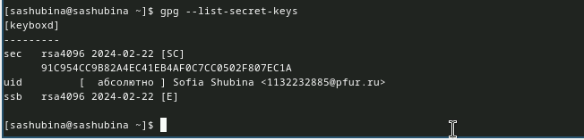{#fig:003 width=70%}

Если ключа нет, нужно создать новый:
gpg --full-generate-key
Инициализация хранилища
Инициализируем хранилище:
pass init <gpg-id or email>
(рис. [-@fig:004]).

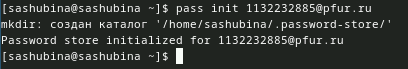{#fig:004 width=70%}

Синхронизация с git
Создадим структуру git:
pass git init
(рис. [-@fig:005]).

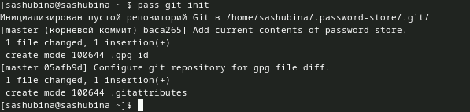{#fig:005 width=70%}

Также можно задать адрес репозитория на хостинге (репозиторий необходимо предварительно создать):
pass git remote add origin git@github.com:<git_username>/<git_repo>.git
(рис. [-@fig:006], [-@fig:007]).

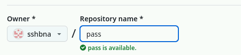{#fig:006 width=70%}

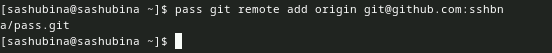{#fig:007 width=70%}

Для синхронизации выполняется следующая команда:
pass git pull
pass git push
(рис. [-@fig:008]).

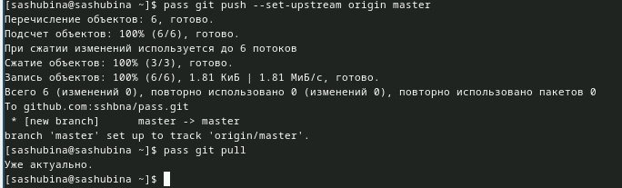{#fig:008 width=70%}

Прямые изменения
Следует заметить, что отслеживаются только изменения, сделанные через сам gopass (или pass).
Если изменения сделаны непосредственно на файловой системе, необходимо вручную закоммитить и выложить изменения:
cd ~/.password-store/
git add .
git commit -am 'edit manually'
git push
(рис. [-@fig:009]).

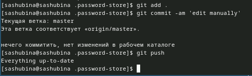{#fig:009 width=70%}

Проверить статус синхронизации модно командой
pass git status
(рис. [-@fig:010]).

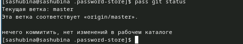{#fig:010 width=70%}

Настройка интерфейса с броузером
Для взаимодействия с броузером используется интерфейс native messaging.
Поэтому кроме плагина к броузеру устанавливается программа, обеспечивающая интерфейс native messaging.
Fedora
dnf copr enable maximbaz/browserpass
dnf install browserpass
(рис. [-@fig:011], [-@fig:012]).

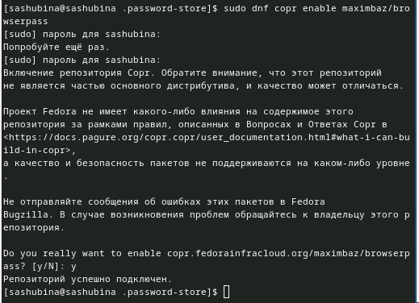{#fig:011 width=70%}
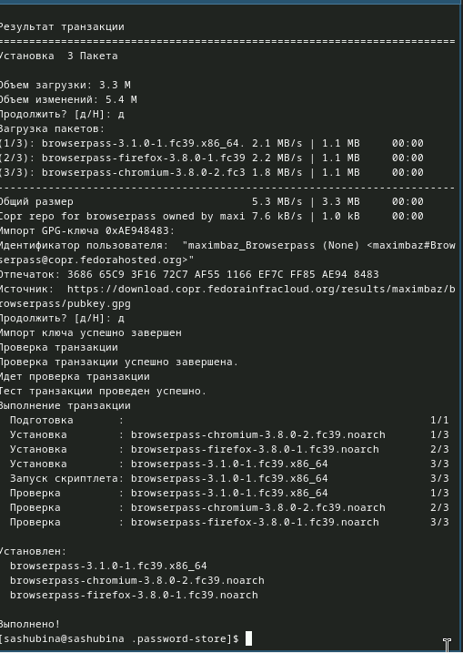{#fig:012 width=70%}

Сохранение пароля
Добавить новый пароль
Выполните:
pass insert [OPTIONAL DIR]/[FILENAME]
OPTIONAL DIR: необязательное имя каталога, определяющее файловую структуру для вашего хранилища паролей;
FILENAME: имя файла, который будет использоваться для хранения пароля.
Отобразите пароль для указанного имени файла:
pass [OPTIONAL DIR]/[FILENAME]
Замените существующий пароль:
pass generate --in-place FILENAME
(рис. [-@fig:013]).

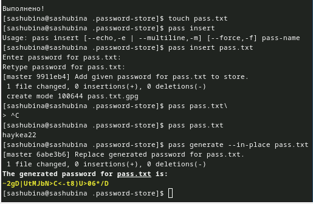{#fig:013 width=70%}

Управление файлами конфигурации
Дополнительное программное обеспечение
Установите дополнительное программное обеспечение:
sudo dnf -y install \
dunst \
fontawesome-fonts \
powerline-fonts \
light \
fuzzel \
swaylock \
kitty \
waybar swaybg \
wl-clipboard \
mpv \
grim \
slurp
(рис. [-@fig:014]).

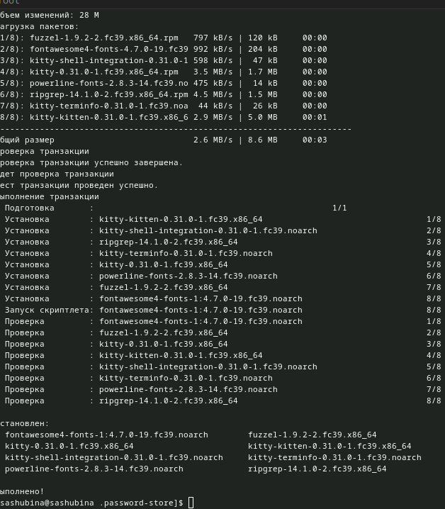{#fig:014 width=70%}

Установите шрифты:
sudo dnf copr enable peterwu/iosevka
sudo dnf search iosevka
sudo dnf install iosevka-fonts iosevka-aile-fonts iosevka-curly-fonts iosevka-slab-fonts iosevka-etoile-fonts iosevka-term-fonts
(рис. [-@fig:015]).

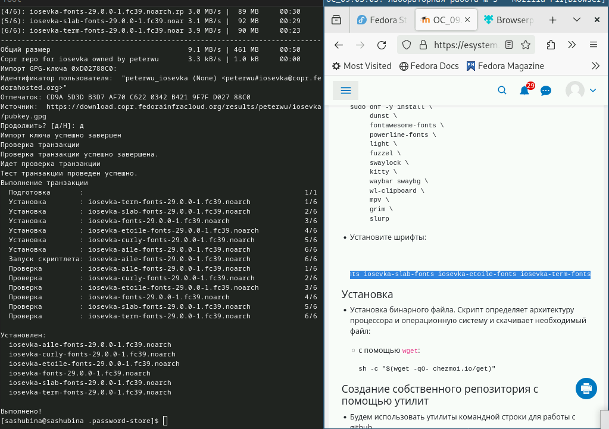{#fig:015 width=70%}

Установка
Установка бинарного файла. Скрипт определяет архитектуру процессора и операционную систему и скачивает необходимый файл:
с помощью wget:
sh -c "$(wget -qO- chezmoi.io/get)"
(рис. [-@fig:016]).

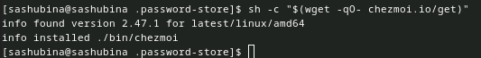{#fig:016 width=70%}

Создание собственного репозитория с помощью утилит
Будем использовать утилиты командной строки для работы с github.
Создадим свой репозиторий для конфигурационных файлов на основе шаблона:
gh repo create dotfiles --template="yamadharma/dotfiles-template" --private
(рис. [-@fig:017]).

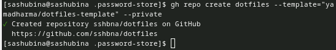{#fig:017 width=70%}

Подключение репозитория к своей системе
Инициализируйте chezmoi с вашим репозиторием dotfiles:
chezmoi init git@github.com:<username>/dotfiles.git
(рис. [-@fig:018]).

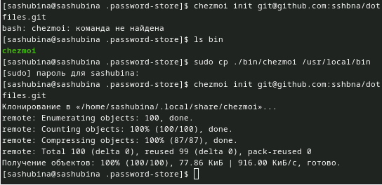{#fig:018 width=70%}

Проверьте, какие изменения внесёт chezmoi в домашний каталог, запустив:
chezmoi diff
Если вас устраивают изменения, внесённые chezmoi, запустите:
chezmoi apply -v
(рис. [-@fig:019]).

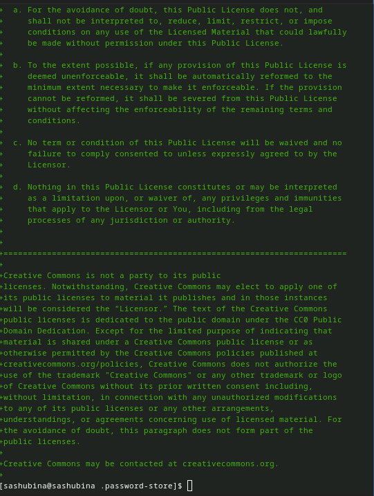{#fig:019 width=70%}

Использование chezmoi на нескольких машинах
На второй машине инициализируйте chezmoi с вашим репозиторием dotfiles:
chezmoi init https://github.com/<username>/dotfiles.git
Или через ssh:
chezmoi init git@github.com:<username>/dotfiles.git
Проверьте, какие изменения внесёт chezmoi в домашний каталог, запустив:
chezmoi diff
Если вас устраивают изменения, внесённые chezmoi, запустите:
chezmoi apply -v
Если вас не устраивают изменения в файле, отредактируйте его с помощью:
chezmoi edit file_name
Также можно вызвать инструмент слияния, чтобы объединить изменения между текущим содержимым файла, файлом в вашей рабочей копии и измененным содержимым файла:
chezmoi merge file_name
При существующем каталоге chezmoi можно получить и применить последние изменения из вашего репозитория:
chezmoi update -v
Настройка новой машины с помощью одной команды
 Можно установить свои dotfiles на новый компьютер с помощью одной команды:
сhezmoi init --apply https://github.com/<username>/dotfiles.git
(рис. [-@fig:020]).

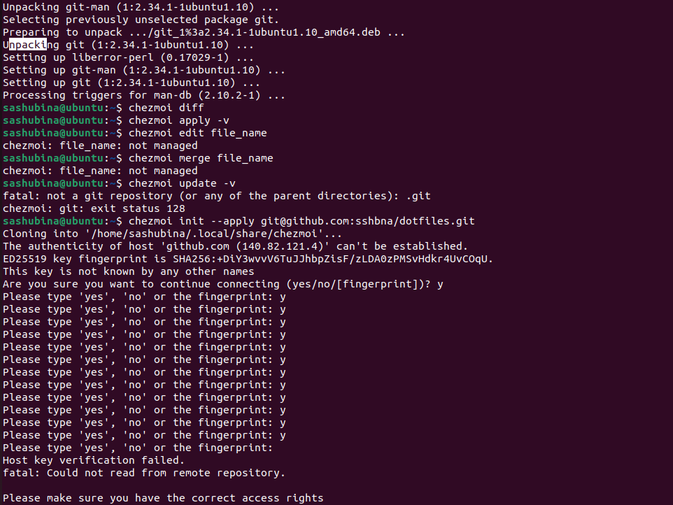{#fig:020 width=70%}

Ежедневные операции c chezmoi
Извлеките последние изменения из репозитория и примените их
Можно извлечь изменения из репозитория и применить их одной командой:
chezmoi update
Это запускается git pull --autostash --rebase в вашем исходном каталоге, а затем chezmoi apply.
Извлеките последние изменения из своего репозитория и посмотрите, что изменится, фактически не применяя изменения
Выполните:
chezmoi git pull -- --autostash --rebase && chezmoi diff
Это запускается git pull --autostash --rebase в вашем исходном каталоге, а chezmoi diff затем показывает разницу между целевым состоянием, вычисленным из вашего исходного каталога, и фактическим состоянием.
(рис. [-@fig:021]).

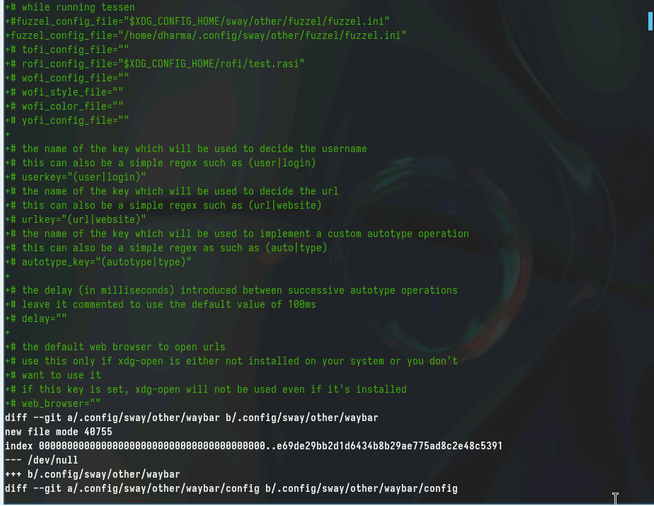{#fig:021 width=70%}

Если вы довольны изменениями, вы можете применить их:
chezmoi apply
Можно автоматически фиксировать и отправлять изменения в исходный каталог в репозиторий.
Эта функция отключена по умолчанию.
Чтобы включить её, добавьте в файл конфигурации ~/.config/chezmoi/chezmoi.toml следующее:
 [git]
autoCommit = true
autoPush = true
(рис. [-@fig:022]).

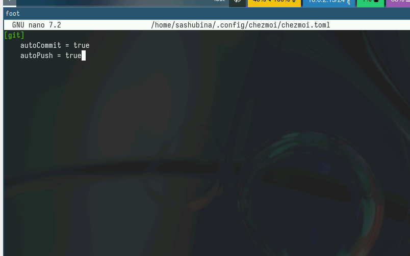{#fig:022 width=70%}

Всякий раз, когда в исходный каталог вносятся изменения, chezmoi фиксирует изменения с помощью автоматически сгенерированного сообщения фиксации и отправляет их в ваш репозиторий.
Будьте осторожны при использовании autoPush. Если ваш репозиторий dotfiles является общедоступным, и вы случайно добавили секрет в виде обычного текста, этот секрет будет отправлен в ваш общедоступный репозиторий.

# Выводы
Я научилась работать с менеджером паролей

# Список литературы{.unnumbered}

::: {#refs}
:::
