---
## Front matter
lang: ru-RU
title: "Презентация по лабораторной работе №6"
author:
  - Шубина С.А.
institute:
  - Российский университет дружбы народов, Москва, Россия
date: 16 марта 2024

## i18n babel
babel-lang: russian
babel-otherlangs: english

## Formatting pdf
toc: false
toc-title: Содержание
slide_level: 2
aspectratio: 169
section-titles: true
theme: metropolis
header-includes:
 - \metroset{progressbar=frametitle,sectionpage=progressbar,numbering=fraction}
 - '\makeatletter'
 - '\beamer@ignorenonframefalse'
 - '\makeatother'
## Fonts
mainfont: PT Serif
romanfont: PT Serif
sansfont: PT Sans
monofont: PT Mono
mainfontoptions: Ligatures=TeX
romanfontoptions: Ligatures=TeX
sansfontoptions: Ligatures=TeX,Scale=MatchLowercase
monofontoptions: Scale=MatchLowercase,Scale=0.9
---

# Информация

## Докладчик

  * Шубина София Антоновна
  * студент
  * факультет физико-математических и естественных наук,направление-прикладная информатика
  * Российский университет дружбы народов
  * [1132232885@pfur.ru](mailto:1132232885@pfur.ru)

::::::::::::::

## Цель работы
Приобретение практических навыков взаимодействия пользователя с системой по-
средством командной строки.

## Выполнение лабораторной работы
Определите полное имя вашего домашнего каталога. Далее относительно этого ката-
лога будут выполняться последующие упражнения.
## 2. Выполните следующие действия:
2.1. Перейдите в каталог /tmp.

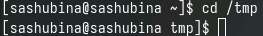{.column width="70%"}

## 2.2. Выведите на экран содержимое каталога /tmp. Для этого используйте команду ls
с различными опциями. Поясните разницу в выводимой на экран информации.

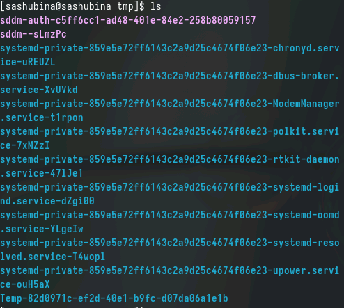{.column width="70%"}

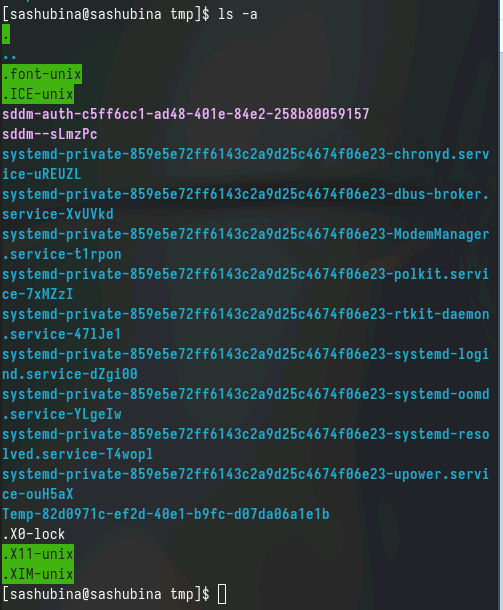{.column width="70%"}

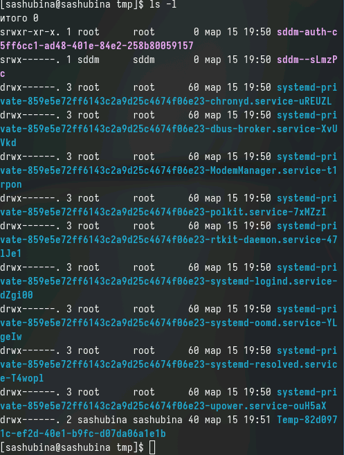{.column width="70%"}

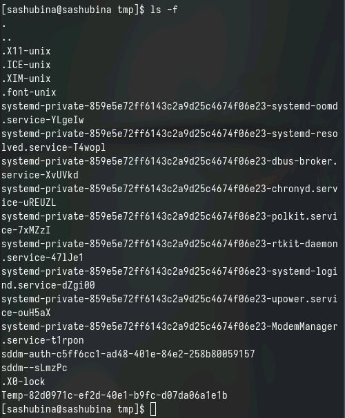{.column width="70%"}

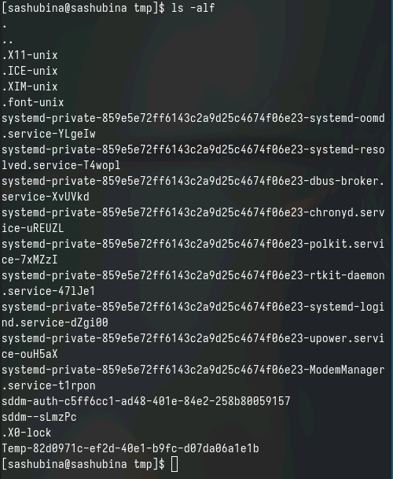{.column width="70%"}

## 2.3. Определите, есть ли в каталоге /var/spool подкаталог с именем cron?-да,есть подкаталог с именем cron

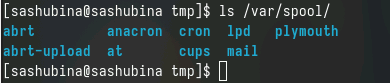{.column width="70%"}

## 2.4. Перейдите в Ваш домашний каталог и выведите на экран его содержимое. 
Определите, кто является владельцем файлов и подкаталогов?

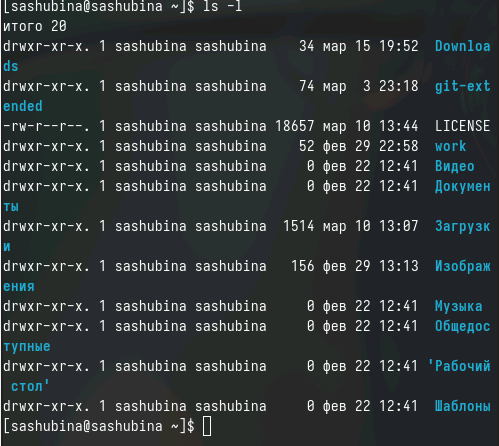{.column width="70%"}

## 3. Выполните следующие действия:
3.1. В домашнем каталоге создайте новый каталог с именем newdir.

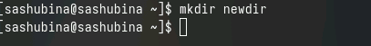{.column width="70%"}

## 3.2. В каталоге ~/newdir создайте новый каталог с именем morefun.

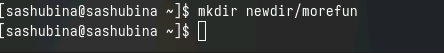{.column width="70%"}

## 3.3. В домашнем каталоге создайте одной командой три новых каталога с именами
letters, memos, misk. Затем удалите эти каталоги одной командой.

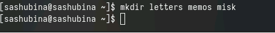{.column width="70%"}

## 3.4. Попробуйте удалить ранее созданный каталог ~/newdir командой rm. Проверьте,
был ли каталог удалён.

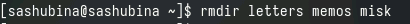{.column width="70%"}

## 3.5. Удалите каталог ~/newdir/morefun из домашнего каталога. Проверьте, был ли
каталог удалён.

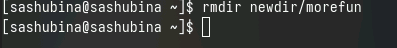{.column width="70%"}

##4. С помощью команды man определите, какую опцию команды ls нужно использовать для просмотра содержимое не только указанного каталога, но и подкаталогов,входящих в него.
Мы узнали,что для просмотра содержимого всех подкаталогов входящих в каталог требуется опция -R. А набор опций команды ls можно использовать ls -t -l  и отсортировать последние изменения по времени

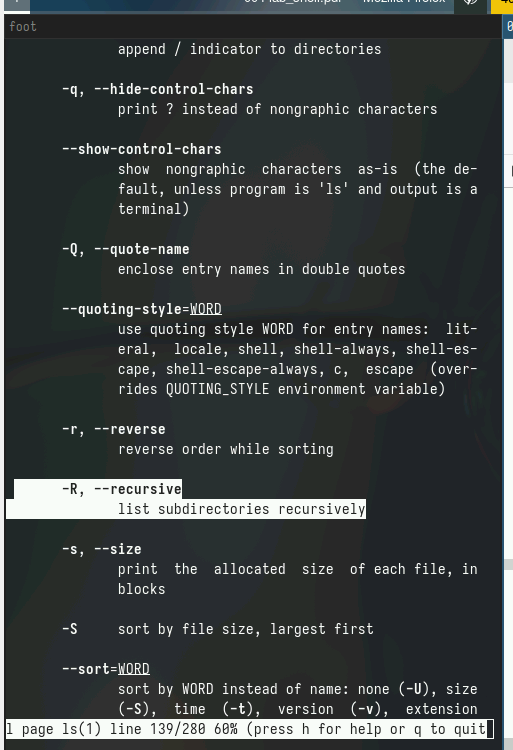{.column width="70%"}

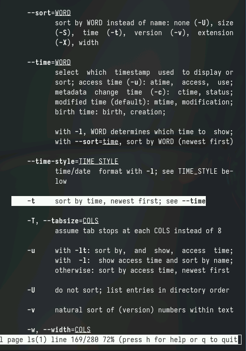{.column width="70%"}

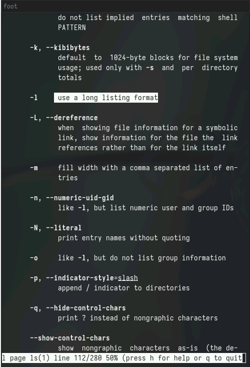{.column width="70%"}

## 5. С помощью команды man определите набор опций команды ls, позволяющий отсортировать по времени последнего изменения выводимый список содержимого каталога с развёрнутым описанием файлов.
Набор опций команды ls можно использовать ls -t -l  и отсортировать последние изменения по времени.

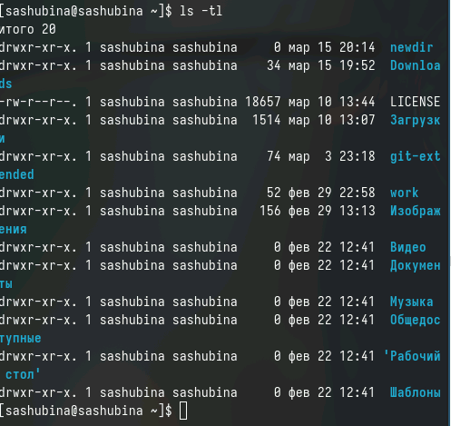{.column width="70%"}

## 6. Используйте команду man для просмотра описания следующих команд: cd, pwd, mkdir,
rmdir, rm. Поясните основные опции этих команд.
## 1. Команда cd используется для изменения текущего каталога. Основные опции:

- cd <директория>: изменить текущий каталог на указанную директорию.
- cd ~: изменить текущий каталог на домашний каталог пользователя.
- cd -: изменить текущий каталог на предыдущий каталог.

## 2. Команда pwd (print working directory) выводит абсолютный путь текущего каталога. Основные опции:

- pwd -P: выводит физический путь каталога (без символьных ссылок).
- pwd -L: выводит логический путь каталога (с символьными ссылками).

## 3. Команда mkdir используется для создания новых каталогов. Основные опции:

- mkdir <имя>: создать каталог с указанным именем.
- mkdir -p <путь>: создать каталоги в указанном пути, создавая отсутствующие промежуточные каталоги.

## 4. Команда rmdir используется для удаления пустых каталогов. Основные опции:

- rmdir <имя>: удалить указанный пустой каталог.

## 5. Команда rm используется для удаления файлов или каталогов. Основные опции:

- rm <файл>: удалить указанный файл.
- rm -r <каталог>: удалить каталог и его содержимое рекурсивно (включая подкаталоги и файлы).
- rm -f <файл>: удалить файл без подтверждения.
- rm -i <файл>: запрашивать подтверждение перед удалением каждого файла.

Эти опции помогают более гибко использовать команды cd, pwd, mkdir, rmdir, rm в зависимости от требуемых операций.

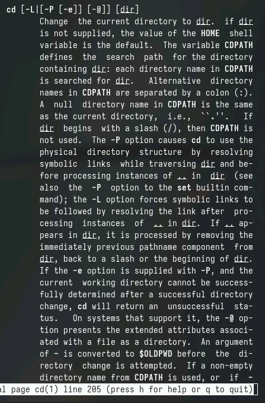{.column width="70%"}

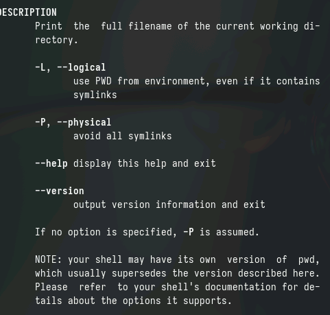{.column width="70%"}

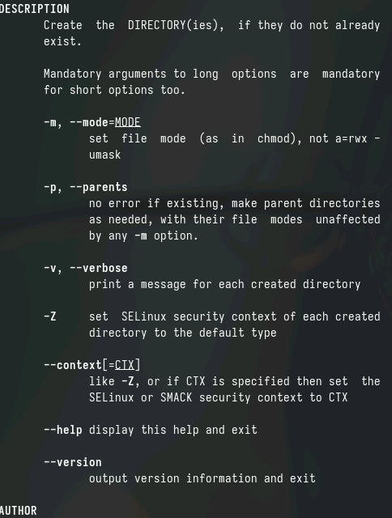{.column width="70%"}

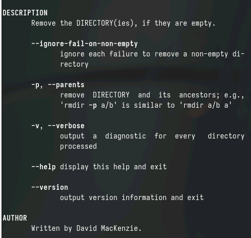{.column width="70%"}

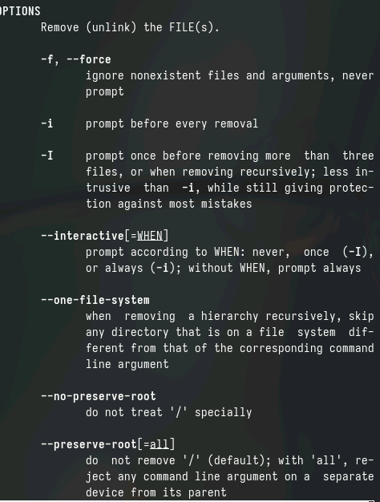{.column width="70%"}

## 7. Используя информацию, полученную при помощи команды history, выполните мо-
дификацию и исполнение нескольких команд из буфера команд.

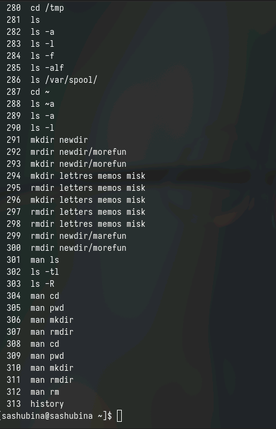{.column width="70%"}

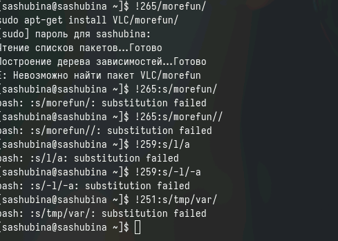{.column width="70%"}

# Контрольные вопросы 
## 1. 
Командная строка - это интерфейс взаимодействия пользователя с операционной системой, позволяющий вводить команды для выполнения различных операций.
## 2.
 Для определения абсолютного пути текущего каталога можно использовать команду pwd:
pwd
## 3. 
Для определения только типов файлов и их имен в текущем каталоге можно использовать команду ls с опцией -l:
shell
ls -l | grep "^-"
## 4. 
Для отображения скрытых файлов можно использовать опцию -a команды ls:
ls -a
## 5. 
Для удаления файла используется команда rm, для удаления каталога - команда rm -r:
shell
rm file.txt
rm -r directory
## 6.
 Информацию о последних выполненных пользователем командах можно получить с помощью команды history.
## 7. 
Для модификации и выполнения команд из истории можно использовать восклицательный знак (!) с номером команды:
!10
## 8. 
Пример запуска нескольких команд в одной строке:
shell
ls -l; pwd
## 9. 
Символ экранирования (\) используется для отмены специального значения символа, например, пробела:
shell
touch file\ name.txt
## 10. 
При использовании опции -l команды ls выводится информация о файлах в виде списка со всеми подробностями, такими как права доступа, владелец, группа, размер, дата модификации и т.д.
## 11. 
Относительный путь к файлу - это путь, указывающий на файл относительно текущего каталога. Пример использования относительного пути: 
shell
cd ../dir
## 12. 
Информацию о команде можно получить с помощью команды man, например: 
man ls
## 13. 
Для автоматического дополнения вводимых команд используется клавиша Tab.

# Выводы
Я приобрела практические навыки взаимодействмя пользователя с системой посредством командной строки
:::

