---
## Front matter
title: "Отчет по лабораторной работе № 7"

author: "Шубина София Антоновна"

## Generic otions
lang: ru-RU
toc-title: "Содержание"

## Bibliography
bibliography: bib/cite.bib
csl: pandoc/csl/gost-r-7-0-5-2008-numeric.csl

## Pdf output format
toc: true # Table of contents
toc-depth: 2
lof: true # List of figures
lot: true # List of tables
fontsize: 12pt
linestretch: 1.5
papersize: a4
documentclass: scrreprt
## I18n polyglossia
polyglossia-lang:
  name: russian
  options:
	- spelling=modern
	- babelshorthands=true
polyglossia-otherlangs:
  name: english
## I18n babel
babel-lang: russian
babel-otherlangs: english
## Fonts
mainfont: PT Serif
romanfont: PT Serif
sansfont: PT Sans
monofont: PT Mono
mainfontoptions: Ligatures=TeX
romanfontoptions: Ligatures=TeX
sansfontoptions: Ligatures=TeX,Scale=MatchLowercase
monofontoptions: Scale=MatchLowercase,Scale=0.9
## Biblatex
biblatex: true
biblio-style: "gost-numeric"
biblatexoptions:
  - parentracker=true
  - backend=biber
  - hyperref=auto
  - language=auto
  - autolang=other*
  - citestyle=gost-numeric
## Pandoc-crossref LaTeX customization
figureTitle: "Рис."
tableTitle: "Таблица"
listingTitle: "Листинг"
lofTitle: "Список иллюстраций"
lotTitle: "Список таблиц"
lolTitle: "Листинги"
## Misc options
indent: true
header-includes:
  - \usepackage{indentfirst}
  - \usepackage{float} # keep figures where there are in the text
  - \floatplacement{figure}{H} # keep figures where there are in the text

---

# Цель работы
Ознакомление с файловой системой Linux, её структурой, именами и содержанием
каталогов. Приобретение практических навыков по применению команд для работы
с файлами и каталогами, по управлению процессами (и работами), по проверке исполь-
зования диска и обслуживанию файловой системы.
[@tuis_rudn]
# Выполнение лабораторной работы
1. Выполните все примеры, приведённые в первой части описания лабораторной работы.
(рис. [-@fig:001],[-@fig:002].[-@fig:003],[-@fig:004],[-@fig:005],[-@fig:006],[-@fig:007],[-@fig:008],[-@fig:009],[-@fig:010],[-@fig:011],[-@fig:012],[-@fig:013]).
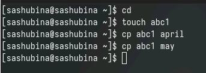{#fig:001 width=70%}

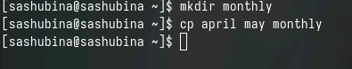{#fig:002 width=70%}

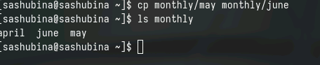{#fig:003 width=70%}

{#fig:004 width=70%}

{#fig:005 width=70%}

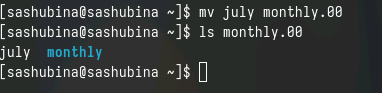{#fig:006 width=70%}

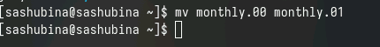{#fig:007 width=70%}

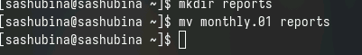{#fig:008 width=70%}

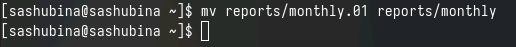{#fig:009 width=70%}

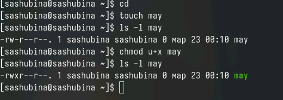{#fig:010 width=70%}

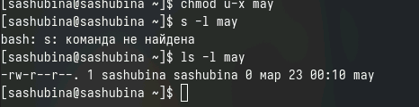{#fig:011 width=70%}

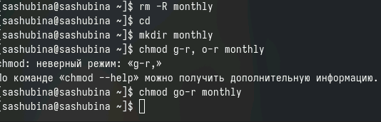{#fig:012 width=70%}

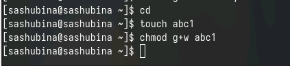{#fig:013 width=70%}

2. Выполните следующие действия, зафиксировав в отчёте по лабораторной работе
используемые при этом команды и результаты их выполнения:
2.1. Скопируйте файл /usr/include/sys/io.h в домашний каталог и назовите его
equipment. Если файла io.h нет, то используйте любой другой файл в каталоге
/usr/include/sys/ вместо него.
(рис. [-@fig:014]).

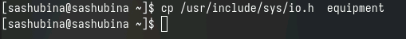{#fig:014 width=70%}

2.2. В домашнем каталоге создайте директорию ~/ski.plases.
(рис. [-@fig:015]).

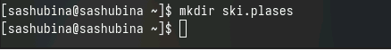{#fig:015 width=70%}

2.3. Переместите файл equipment в каталог ~/ski.plases.
(рис. [-@fig:016]).

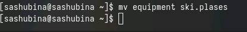{#fig:016 width=70%}

2.4. Переименуйте файл ~/ski.plases/equipment в ~/ski.plases/equiplist.
(рис. [-@fig:017]).

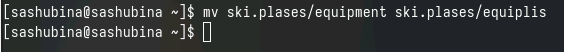{#fig:017 width=70%}

2.5. Создайте в домашнем каталоге файл abc1 и скопируйте его в каталог
~/ski.plases, назовите его equiplist2.
(рис. [-@fig:018).

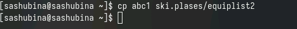{#fig:018 width=70%}

2.6. Создайте каталог с именем equipment в каталоге ~/ski.plases.
(рис. [-@fig:019]).

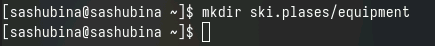{#fig:019 width=70%}

2.7. Переместите файлы ~/ski.plases/equiplist и equiplist2 в каталог
~/ski.plases/equipment.
2.8. Создайте и переместите каталог ~/newdir в каталог ~/ski.plases и назовите
его plans.
(рис. [-@fig:020]).

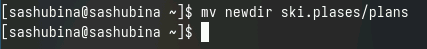{#fig:020 width=70%}

3. Определите опции команды chmod, необходимые для того, чтобы присвоить перечис-
ленным ниже файлам выделенные права доступа, считая, что в начале таких прав
нет:
3.1. drwxr--r-- ... australia
3.2. drwx--x--x ... play
3.3. -r-xr--r-- ... my_os
3.4. -rw-rw-r-- ... feathers
При необходимости создайте нужные файлы.
(рис. [-@fig:021]).

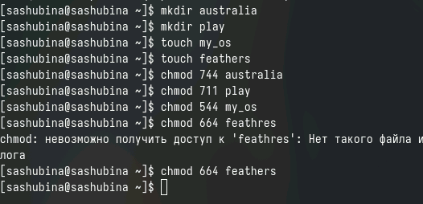{#fig:021 width=70%}

4. Проделайте приведённые ниже упражнения, записывая в отчёт по лабораторной
работе используемые при этом команды:
4.1. Просмотрите содержимое файла /etc/password.
4.2. Скопируйте файл ~/feathers в файл ~/file.old.
4.3. Переместите файл ~/file.old в каталог ~/play.
4.4. Скопируйте каталог ~/play в каталог ~/fun.
4.5. Переместите каталог ~/fun в каталог ~/play и назовите его games.
4.6. Лишите владельца файла ~/feathers права на чтение.
4.7. Что произойдёт, если вы попытаетесь просмотреть файл ~/feathers командой
cat?
4.8. Что произойдёт, если вы попытаетесь скопировать файл ~/feathers?
4.9. Дайте владельцу файла ~/feathers право на чтение.
4.10. Лишите владельца каталога ~/play права на выполнение.
4.11. Перейдите в каталог ~/play. Что произошло?
4.12. Дайте владельцу каталога ~/play право на выполнение.
(рис. [-@fig:022]).

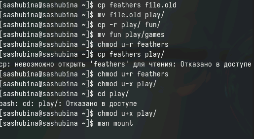{#fig:022 width=70%}

5. Прочитайте man по командам mount, fsck, mkfs, kill и кратко их охарактеризуйте, приведя пример
(рис. [-@fig:023],[-@fig:024],[-@fig:025],[-@fig:026]).

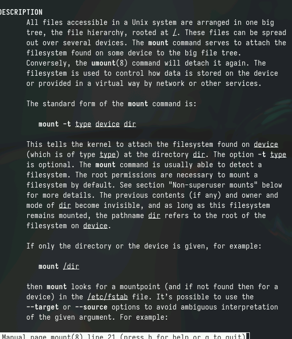{#fig:023 width=70%}

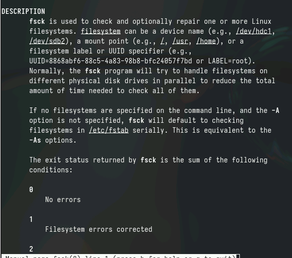{#fig:024 width=70%}

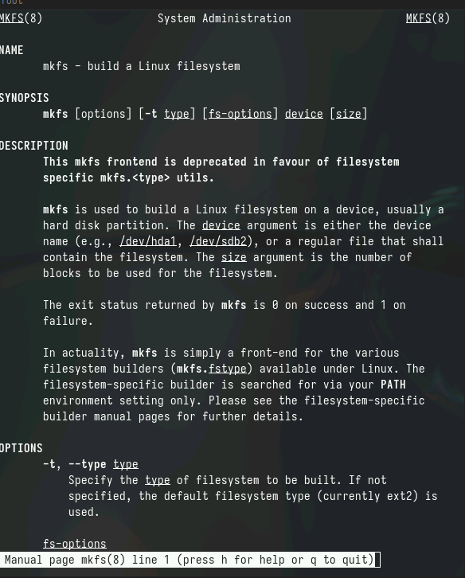{#fig:025 width=70%}

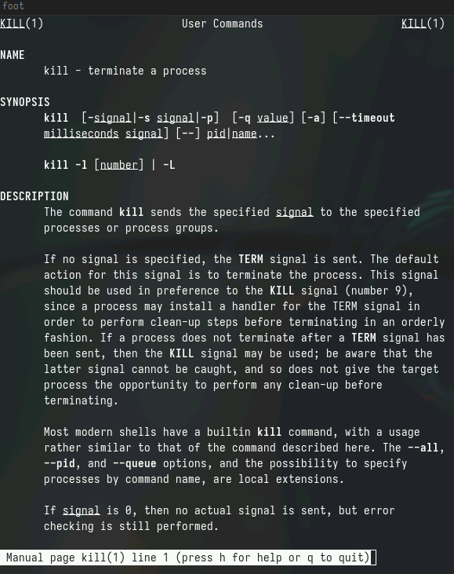{#fig:026 width=70%}
1. mount - это команда в UNIX-подобных системах, которая позволяет подключать файловые системы к директориям в иерархии файловой системы.
Пример:
mount /dev/sdb1 /mnt/usb
2. fsck - это утилита для проверки и восстановления целостности файловой системы. Она исправляет ошибки и испорченные блоки данных на диске.
Пример:
fsck /dev/sda1
3. mkfs - это команда для создания новой файловой системы на блочном устройстве, например жестком диске или флэш-накопителе.
Пример:
mkfs.ext4 /dev/sdb1
4. kill - команда, используемая для отправки сигналов процессам, позволяющая завершить процессы или изменить их поведение.
Пример:
kill -9 1234

 (рис. [-@fig:001]).

{#fig:001 width=70%}
# Контрольные вопросы
1. На моем компьютере существуют файловые системы NTFS (Windows) и ext4 (Linux). NTFS - проприетарная файловая система, разработанная компанией Microsoft, хорошо поддерживает большие файлы и объемы дисков, но не полностью совместима с Linux. ext4 - стандартная файловая система для большинства дистрибутивов Linux, хорошо поддерживает разделение на разные разделы и файлы любого размера.

2. Общая структура файловой системы включает в себя директории первого уровня, такие как /bin (для исполняемых файлов), /etc (для конфигурационных файлов), /home (для домашних папок пользователей), /var (для переменных данных), /tmp (для временных файлов).

3. Для доступности содержимого файловой системы операционной системе необходимо выполнить монтирование диска или раздела, на котором находится эта файловая система.

4. Основные причины нарушения целостности файловой системы могут быть физические повреждения диска, отключение питания во время работы, ошибки программного обеспечения. Для восстановления целостности файловой системы можно использовать утилиты типа fsck.

5. Файловая система создается при форматировании диска или раздела, в процессе которого на нем создаются структуры для хранения файлов и метаданных.

6. Команды для просмотра текстовых файлов включают в себя cat, less, more, head, tail. Например, команда cat отображает содержимое файла целиком.

7. Основные возможности команды cp в Linux включают копирование файлов с сохранением атрибутов, возможность копирования нескольких файлов или папок, переименование файлов при копировании.

8. Основные возможности команды mv в Linux включают перемещение файла или папки из одного места в другое, изменение имени файла или папки при перемещении.

9. Права доступа в файловой системе определяют, кто и как может обращаться к файлам и папкам. Они могут быть изменены с помощью команды chmod в Linux, которая позволяет устанавливать различные права на чтение, запись и исполнение для владельца, группы и остальных пользователей.

# Выводы
Я ознакомилась с файловой системой Linux. ее структурой,именами и содержанием каталогов. Приобрела практические навыки про применению команд для работы с файлами и каталогами, по управлению поцессами(и работами), по проверке использования диска и обслуживанию файловой системы.

# Список литературы{.unnumbered}

::: {#refs}
:::
