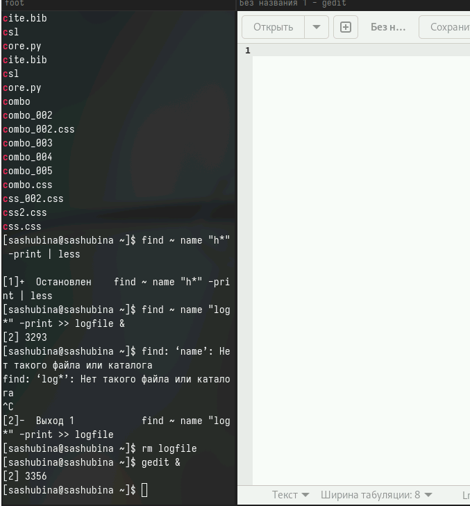

---
## Front matter
title: Отчет по лабораторной работе № 8
author: Шубина София Антоновна

## Generic otions
lang: ru-RU
toc-title: "Содержание"

## Bibliography
bibliography: bib/cite.bib
csl: pandoc/csl/gost-r-7-0-5-2008-numeric.csl

## Pdf output format
toc: true # Table of contents
toc-depth: 2
lof: true # List of figures
lot: true # List of tables
fontsize: 12pt
linestretch: 1.5
papersize: a4
documentclass: scrreprt
## I18n polyglossia
polyglossia-lang:
  name: russian
  options:
	- spelling=modern
	- babelshorthands=true
polyglossia-otherlangs:
  name: english
## I18n babel
babel-lang: russian
babel-otherlangs: english
## Fonts
mainfont: PT Serif
romanfont: PT Serif
sansfont: PT Sans
monofont: PT Mono
mainfontoptions: Ligatures=TeX
romanfontoptions: Ligatures=TeX
sansfontoptions: Ligatures=TeX,Scale=MatchLowercase
monofontoptions: Scale=MatchLowercase,Scale=0.9
## Biblatex
biblatex: true
biblio-style: "gost-numeric"
biblatexoptions:
  - parentracker=true
  - backend=biber
  - hyperref=auto
  - language=auto
  - autolang=other*
  - citestyle=gost-numeric
## Pandoc-crossref LaTeX customization
figureTitle: "Рис."
tableTitle: "Таблица"
listingTitle: "Листинг"
lofTitle: "Список иллюстраций"
lotTitle: "Список таблиц"
lolTitle: "Листинги"
## Misc options
indent: true
header-includes:
  - \usepackage{indentfirst}
  - \usepackage{float} # keep figures where there are in the text
  - \floatplacement{figure}{H} # keep figures where there are in the text
---

# Цель работы
Ознакомление с инструментами поиска файлов и фильтрации текстовых данных.
Приобретение практических навыков: по управлению процессами (и заданиями), по проверке использования диска и обслуживанию файловых систем.

# Выполнение лабораторной работы
1. Осуществите вход в систему, используя соответствующее имя пользователя.
(рис. [-@fig:001]).

{#fig:001 width=70%}

2. Запишите в файл file.txt названия файлов, содержащихся в каталоге /etc. Допишите в этот же файл названия файлов, содержащихся в вашем домашнем каталоге.
(рис. [-@fig:002]).

{#fig:002 width=70%}

3. Выведите имена всех файлов из file.txt, имеющих расши
рение .conf, после чегозапишите их в новый текстовой файл conf.txt.
(рис. [-@fig:003]).

{#fig:003 width=70%}

4. Определите, какие файлы в вашем домашнем каталоге имеют имена, начинавшиеся
с символа c? Предложите несколько вариантов, как это сделать.
(рис. [-@fig:004], [-@fig:005], [-@fig:006], [-@fig:007]).

{#fig:004 width=70%}

{#fig:005 width=70%}

{#fig:006 width=70%}

{#fig:007 width=70%}

5. Выведите на экран (по странично) имена файлов из каталога /etc, начинающиеся
с символа h.
(рис. [-@fig:008]).

{#fig:008 width=70%}

6. Запустите в фоновом режиме процесс, который будет записывать в файл ~/logfile
файлы, имена которых начинаются с log.
(рис. [-@fig:009]).

{#fig:009 width=70%}

7. Удалите файл ~/logfile.
(рис. [-@fig:010]).

{#fig:010 width=70%}

8. Запустите из консоли в фоновом режиме редактор gedit.
(рис. [-@fig:011]).

{#fig:011 width=70%}

9. Определите идентификатор процесса gedit, используя команду ps, конвейер и фильтр
grep. Как ещё можно определить идентификатор процесса?
(рис. [-@fig:012]).

{#fig:012 width=70%}

10. Прочтите справку (man) команды kill, после чего используйте её для завершения
процесса gedit.
(рис. [-@fig:013], [-@fig:014]).

{#fig:013 width=70%}

{#fig:014 width=70%}

11. Выполните команды df и du, предварительно получив более подробную информацию
об этих командах, с помощью команды man.
(рис. [-@fig:015], [-@fig:016], [-@fig:017], [-@fig:018]).

{#fig:015 width=70%}

{#fig:016 width=70%}

{#fig:017 width=70%}

{#fig:018 width=70%}

12. Воспользовавшись справкой команды find, выведите имена всех директорий, имею-
щихся в вашем домашнем каталоге.
(рис. [-@fig:019]).

{#fig:019 width=70%}
# Контрольные вопросы 
1. Некоторые из потоков ввода-вывода в Linux: стандартный поток ввода (stdin), стандартный поток вывода (stdout), стандартный поток ошибок (stderr), потоки для чтения/записи файлов, сетевые потоки и т.д.

2. Операция > используется для перенаправления вывода команды в файл, при этом содержимое файла будет перезаписано, если файл уже существует. Операция >> также используется для перенаправления вывода команды в файл, но при этом содержимое будет добавлено в конец файла, не перезаписывая его.

3. Конвейер (pipe) - это механизм в UNIX-подобных системах, который позволяет комбинировать вывод одной команды с вводом другой команды, передавая данные между ними через специальный символ "|".

4. Процесс - это выполнение программы в операционной системе. Программа - это набор инструкций, а процесс - это выполнение этих инструкций в операционной среде. Процессы имеют уникальные идентификаторы (PID).

5. PID (Process ID) - уникальный идентификатор процесса. GID (Group ID) - идентификатор группы, к которой принадлежит процесс.

6. Задачи (jobs) - это процессы, запущенные в фоновом режиме в командной оболочке. Команды для управления задачами: jobs, fg, bg, kill.

7. Утилиты top и htop используются для мониторинга процессов в системе. Top обновляет информацию в реальном времени, htop предоставляет более детальную информацию о процессах и управлению ими.

8. Команда поиска файлов - find. Она позволяет находить файлы и каталоги по различным критериям. Пример использования: find /path/to/directory -name "filename".

9. Да, можно найти файл по его содержанию с помощью команды grep. Пример: grep "search term" filename.

10. Объем свободной памяти на жёстком диске можно определить с помощью команды df -h.

11. Объем вашего домашнего каталога можно определить с помощью команды du -sh ~.

12. Чтобы удалить зависший процесс, можно использовать команду kill -9 <PID> для принудительного завершения процесса с определенным идентификатором.

# Выводы
Я ознакомилась с инструментами поиска файлов и фильтрации текстовых данных.Приобрела практические навыки по управлению процессами и заданиями по проверке использования диска и обслуживанию файловых систем.

# Список литературы{.unnumbered}

::: {#refs}
:::
