---
## Front matter
title: "Отчет по лабораторной работе № 9"
author: "Шубина София Антоновна"

## Generic otions
lang: ru-RU
toc-title: "Содержание"

## Bibliography
bibliography: bib/cite.bib
csl: pandoc/csl/gost-r-7-0-5-2008-numeric.csl

## Pdf output format
toc: true # Table of contents
toc-depth: 2
lof: true # List of figures
lot: true # List of tables
fontsize: 12pt
linestretch: 1.5
papersize: a4
documentclass: scrreprt
## I18n polyglossia
polyglossia-lang:
  name: russian
  options:
	- spelling=modern
	- babelshorthands=true
polyglossia-otherlangs:
  name: english
## I18n babel
babel-lang: russian
babel-otherlangs: english
## Fonts
mainfont: PT Serif
romanfont: PT Serif
sansfont: PT Sans
monofont: PT Mono
mainfontoptions: Ligatures=TeX
romanfontoptions: Ligatures=TeX
sansfontoptions: Ligatures=TeX,Scale=MatchLowercase
monofontoptions: Scale=MatchLowercase,Scale=0.9
## Biblatex
biblatex: true
biblio-style: "gost-numeric"
biblatexoptions:
  - parentracker=true
  - backend=biber
  - hyperref=auto
  - language=auto
  - autolang=other*
  - citestyle=gost-numeric
## Pandoc-crossref LaTeX customization
figureTitle: "Рис."
tableTitle: "Таблица"
listingTitle: "Листинг"
lofTitle: "Список иллюстраций"
lotTitle: "Список таблиц"
lolTitle: "Листинги"
## Misc options
indent: true
header-includes:
  - \usepackage{indentfirst}
  - \usepackage{float} # keep figures where there are in the text
  - \floatplacement{figure}{H} # keep figures where there are in the text
---

# Цель работы
Jсвоение основных возможностей командной оболочки Midnight Commander. Приоб-
ретение навыков практической работы по просмотру каталогов и файлов; манипуляций с ними. [@tuis_rudn]

# Выполнение
1. Изучите информацию о mc, вызвав в командной строке man mc.
(рис. [-@fig:001]).

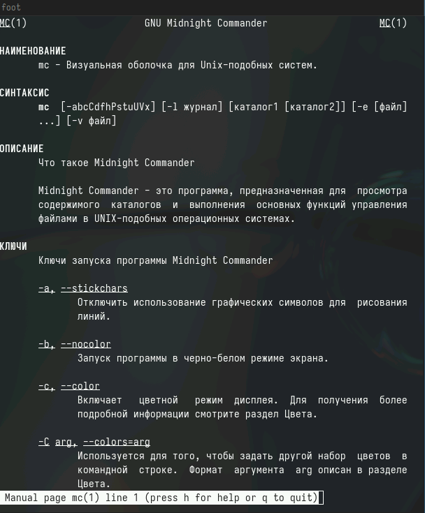{#fig:001 width=70%}

2. Запустите из командной строки mc, изучите его структуру и меню.
Выполните несколько операций в mc, используя управляющие клавиши (операции
с панелями; выделение/отмена выделения файлов, копирование/перемещение фай-
лов, получение информации о размере и правах доступа на файлы и/или каталоги
и т.п.)
(рис. [-@fig:002],[-@fig:003],[-@fig:004],[-@fig:005],[-@fig:006]).

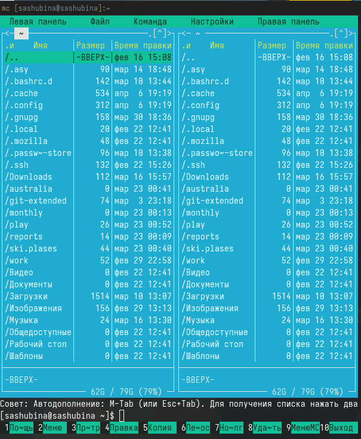{#fig:002 width=70%}

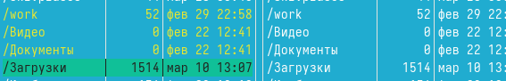{#fig:003 width=70%}

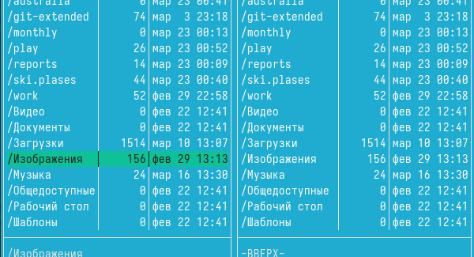{#fig:004 width=70%}

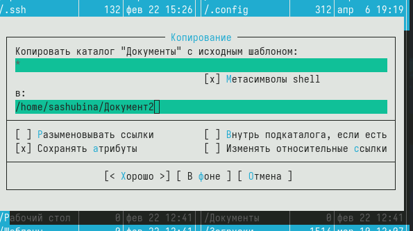{#fig:005 width=70%}

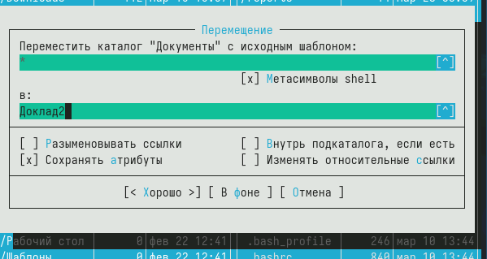{#fig:006 width=70%}

4. Выполните основные команды меню левой (или правой) панели. Оцените степень
подробности вывода информации о файлах.
(рис. [-@fig:007]).

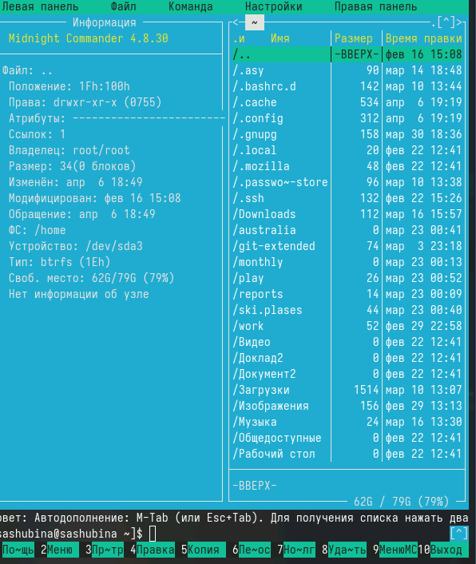{#fig:007 width=70%}

5. Используя возможности подменю Файл , выполните:
– просмотр содержимого текстового файла;
– редактирование содержимого текстового файла (без сохранения результатов
редактирования);
– создание каталога;
– копирование в файлов в созданный каталог.
(рис. [-@fig:008],[-@fig:009], [-@fig:010]).

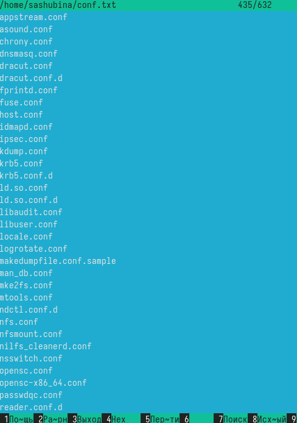{#fig:008 width=70%}

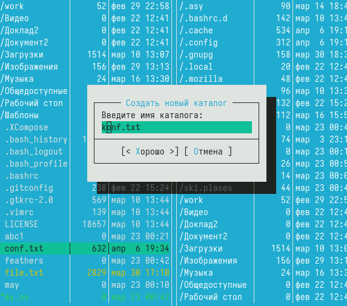{#fig:009 width=70%}

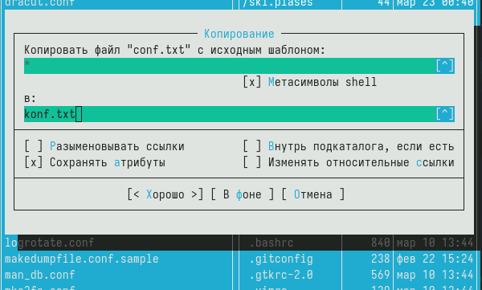{#fig:010 width=70%}

6. С помощью соответствующих средств подменю Команда осуществите:
– поиск в файловой системе файла с заданными условиями (например, файла
с расширением .c или .cpp, содержащего строку main);
– выбор и повторение одной из предыдущих команд;
– переход в домашний каталог;
– анализ файла меню и файла расширений.
(рис. [-@fig:011],[-@fig:012]).

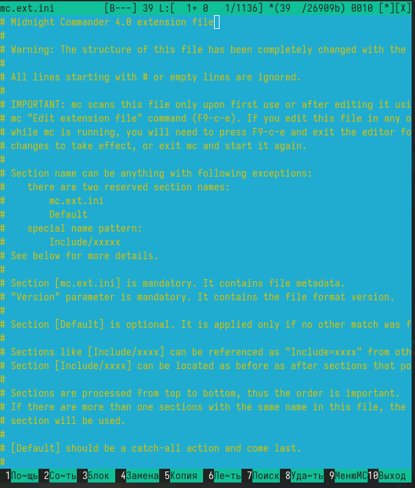{#fig:011 width=70%}

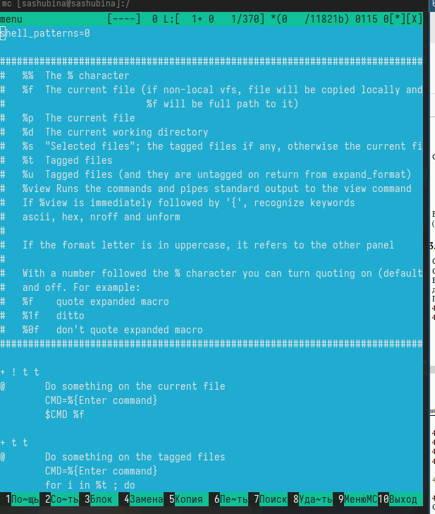{#fig:012 width=70%}

7. Вызовите подменю Настройки . Освойте операции, определяющие структуру экрана mc
(Full screen, Double Width, Show Hidden Files и т.д.)
адание по встроенному редактору mc

1. Создайте текстовой файл text.txt.
2. Откройте этот файл с помощью встроенного в mc редактора.
3. Вставьте в открытый файл небольшой фрагмент текста, скопированный из любого
другого файла или Интернета.
(рис. [-@fig:013]).

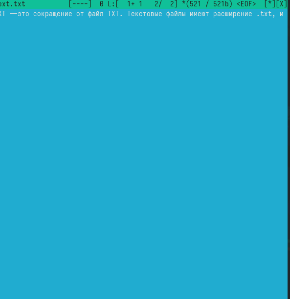{#fig:013 width=70%}

4. Проделайте с текстом следующие манипуляции, используя горячие клавиши:
4.1. Удалите строку текста.
4.2. Выделите фрагмент текста и скопируйте его на новую строку.
Кулябов Д. С. и др. Операционные системы 69
4.3. Выделите фрагмент текста и перенесите его на новую строку.
4.4. Сохраните файл.
4.5. Отмените последнее действие.
4.6. Перейдите в конец файла (нажав комбинацию клавиш) и напишите некоторый
текст.
4.7. Перейдите в начало файла (нажав комбинацию клавиш) и напишите некоторый
текст.
4.8. Сохраните и закройте файл.
5. Откройте файл с исходным текстом на некотором языке программирования (напри-
мер C или Java)
6. Используя меню редактора, включите подсветку синтаксиса, если она не включена,
или выключите, если она включена.

#Контрольные вопросы

1. В mc есть два основных режима работы: режим файлового менеджера (аналогичный обычному файловому менеджеру) и режим командной строки (который позволяет работать с файлами через команды).

2. Операции с файлами, которые можно выполнить как с помощью команд shell, так и с помощью меню mc, включают в себя копирование, перемещение, изменение прав доступа, удаление файлов и папок, создание новых файлов и папок, архивацию и разархивацию.

3. Левая панель mc обычно содержит список файлов и папок текущего каталога, а также меню для выполнения различных действий, таких как копирование, перемещение, изменение прав доступа и другие.

4. Меню Файл включает в себя команды для работы с файлами, такие как создание, копирование, перемещение, удаление, переименование и просмотр файлов.

5. Меню Команда содержит различные команды, которые можно выполнить в текущем каталоге, такие как поиск файлов, изменение прав доступа, выполнение команд shell и другие.

6. Меню Настройки позволяет пользователю настраивать различные параметры mc, такие как цветовую схему, раскладку клавиатуры, настройки просмотра файлов и другие.

7. Встроенные команды mc включают в себя такие функции, как копирование, перемещение, удаление, архивация и распаковка файлов, поиск файлов, изменение прав доступа и другие.

8. Встроенный редактор mc позволяет открывать и редактировать текстовые файлы прямо в файловом менеджере. Он поддерживает стандартные функции редактирования текста и сохранения изменений.

9. Средства mc, позволяющие создавать пользовательские меню, позволяют пользователю создавать собственные команды для выполнения различных действий над файлами и папками.

10. Средства mc, позволяющие пользователю выполнять действия, определяемые пользователем, над текущим файлом, включают в себя возможность добавлять и применять фильтры к файлам, выполнять различные действия над выделенными файлами и папками.
# Выводы
Я освоила основные возможности командной оболочки Midnight Commander. Приобрела навыки практической работы по просмотру каталогов и файлов и манипуляций с ними.

