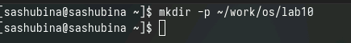
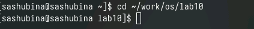
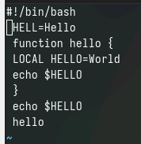
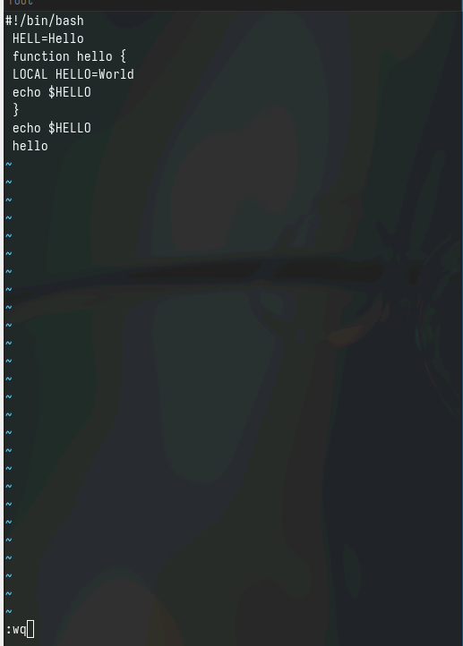
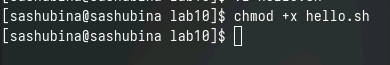
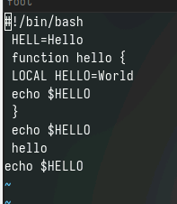

---
## Front matter
title: "Отчет по лабораторной работе № 10"
author: "Шубина София Антоновна"

## Generic otions
lang: ru-RU
toc-title: "Содержание"

## Bibliography
bibliography: bib/cite.bib
csl: pandoc/csl/gost-r-7-0-5-2008-numeric.csl

## Pdf output format
toc: true # Table of contents
toc-depth: 2
lof: true # List of figures
lot: true # List of tables
fontsize: 12pt
linestretch: 1.5
papersize: a4
documentclass: scrreprt
## I18n polyglossia
polyglossia-lang:
  name: russian
  options:
	- spelling=modern
	- babelshorthands=true
polyglossia-otherlangs:
  name: english
## I18n babel
babel-lang: russian
babel-otherlangs: english
## Fonts
mainfont: PT Serif
romanfont: PT Serif
sansfont: PT Sans
monofont: PT Mono
mainfontoptions: Ligatures=TeX
romanfontoptions: Ligatures=TeX
sansfontoptions: Ligatures=TeX,Scale=MatchLowercase
monofontoptions: Scale=MatchLowercase,Scale=0.9
## Biblatex
biblatex: true
biblio-style: "gost-numeric"
biblatexoptions:
  - parentracker=true
  - backend=biber
  - hyperref=auto
  - language=auto
  - autolang=other*
  - citestyle=gost-numeric
## Pandoc-crossref LaTeX customization
figureTitle: "Рис."
tableTitle: "Таблица"
listingTitle: "Листинг"
lofTitle: "Список иллюстраций"
lotTitle: "Список таблиц"
lolTitle: "Листинги"
## Misc options
indent: true
header-includes:
  - \usepackage{indentfirst}
  - \usepackage{float} # keep figures where there are in the text
  - \floatplacement{figure}{H} # keep figures where there are in the text
---

# Цель работы
Познакомиться с операционной системой Linux. Получить практические навыки работы с редактором vi, установленным по умолчанию практически во всех дистрибутивах
[@tuis_rudn]
# Выполнение лабораторной работы
Задание 1. Создание нового файла с использованием vi
1. Создайте каталог с именем ~/work/os/lab06.
(рис. [-@fig:001]).

{#fig:001 width=70%}

2. Перейдите во вновь созданный каталог.
(рис. [-@fig:002]).

{#fig:002 width=70%}

3. Вызовите vi и создайте файл hello.sh
1 vi hello.sh
4. Нажмите клавишу i и вводите следующий текст.
1 #!/bin/bash
2 HELL=Hello
3 function hello {
4 LOCAL HELLO=World
5 echo $HELLO
6 }
7 echo $HELLO
8 hello
(рис. [-@fig:003]).

{#fig:003 width=70%}

5. Нажмите клавишу Esc для перехода в командный режим после завершения ввода
текста.
6. Нажмите : для перехода в режим последней строки и внизу вашего экрана появится
приглашение в виде двоеточия.
7. Нажмите w (записать) и q (выйти), а затем нажмите клавишу Enter для сохранения
вашего текста и завершения работы.
(рис. [-@fig:004]).

{#fig:004 width=70%}

8. Сделайте файл исполняемым
1 chmod +x hello.sh
(рис. [-@fig:005]).

{#fig:005 width=70%}

Задание 2. Редактирование существующего файла
1. Вызовите vi на редактирование файла
1 vi ~/work/os/lab06/hello.sh
2. Установите курсор в конец слова HELL второй строки.
3. Перейдите в режим вставки и замените на HELLO. Нажмите Esc для возврата в команд-
ный режим.
4. Установите курсор на четвертую строку и сотрите слово LOCAL.
5. Перейдите в режим вставки и наберите следующий текст: local, нажмите Esc для
возврата в командный режим.
6. Установите курсор на последней строке файла. Вставьте после неё строку, содержащую
следующий текст: echo $HELLO.
7. Нажмите Esc для перехода в командный режим.
8. Удалите последнюю строку.
9. Введите команду отмены изменений u для отмены последней команды.
10. Введите символ : для перехода в режим последней строки. Запишите произведённые
изменения и выйдите из v
(рис. [-@fig:006]).

{#fig:006 width=70%}

1. Режимы работы редактора vi:
   - Режим командной строки (Command mode): используется для перемещения по тексту, поиска, удаления и других операций над содержимым файла.
   - Режим ввода (Insert mode): позволяет вводить текст в файл.
   - Режим последней строки (Last line mode): для выполнения команд ввода и изменения файла.
   
2. Чтобы выйти из редактора vi, не сохраняя изменения, можно использовать команду ":q!" в режиме командной строки.

3. Команды позиционирования включают:
   - Курсор вправо (l)
   - Курсор влево (h)
   - Курсор вниз (j)
   - Курсор вверх (k)
   
4. В редакторе vi словом является последовательность символов, ограниченная пробелами или другими символами.

5. Для перехода в начало файла в редакторе vi можно использовать команду ":1" в режиме командной строки. Для перехода в конец файла - команду ":$" в режиме командной строки.

6. Основные группы команд редактирования включают:
   - Вставка и удаление текста
   - Копирование и перемещение текста
   - Поиск и замена текста
   - Отмена действий и повтор действий

7. Для заполнения строки символами $ в редакторе vi, можно использовать команду "A" в режиме командной строки, затем ввести символ $ и нажать клавишу Esc для завершения.

8. Для отмены некорректного действия, связанного с процессом редактирования, можно воспользоваться командой "u" в режиме командной строки.

9. Основные группы команд режима последней строки включают:
   - Сохранение файла (:w)
   - Выйти из редактора (:q)
   - Сохранить изменения и выйти (:wq)

10. Для определения позиции, в которой заканчивается строка без перемещения курсора, можно ввести команду "$" в режиме командной строки.

11. Для анализа опций редактора vi можно воспользоваться командой ":options" в режиме командной строки, чтобы узнать их количество, назначение и другие параметры.

12. Режим работы редактора vi можно определить по признакам в интерфейсе, например, позиция курсора, отображаемые команды и прочее.

13. Граф взаимосвязи режимов работы редактора vi:
   - Command mode -> Insert mode
   - Command mode -> Last line mode
   - Insert mode -> Command mode
   - Last line mode -> Command mode

# Выводы
Я познакомилась с операционной системой Linux. Получила практические навыки работы с редактором vi, установленным по умолчанию практически во всех дистрибутивах.

