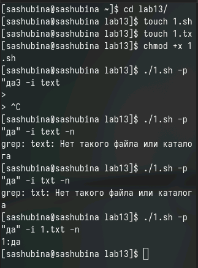
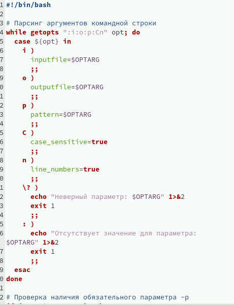
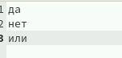
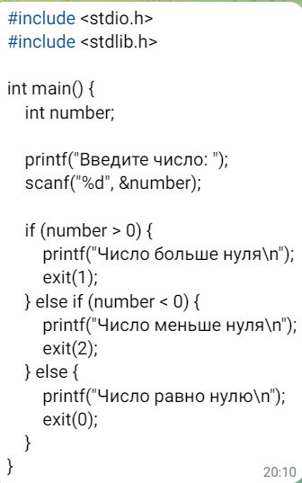
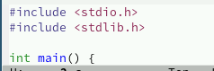
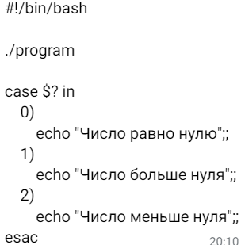
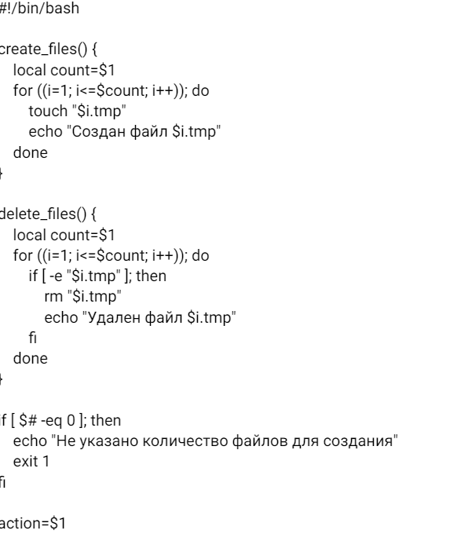
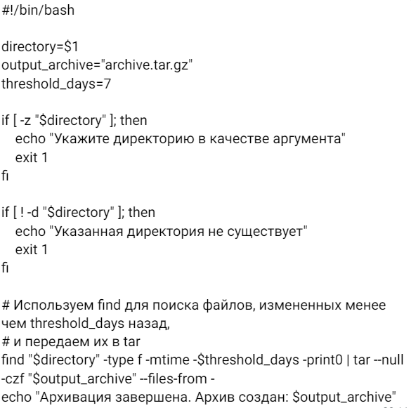

---
## Front matter
lang: ru-RU
title: Презентация по лабораторной работе № 13
author:
  - Шубина С.А.
institute:
  - Российский университет дружбы народов, Москва, Россия
date: 4 мая 2024

## i18n babel
babel-lang: russian
babel-otherlangs: english

## Formatting pdf
toc: false
toc-title: Содержание
slide_level: 2
aspectratio: 169
section-titles: true
theme: metropolis
header-includes:
 - \metroset{progressbar=frametitle,sectionpage=progressbar,numbering=fraction}
 - '\makeatletter'
 - '\beamer@ignorenonframefalse'
 - '\makeatother'
 
## Fonts
mainfont: PT Serif
romanfont: PT Serif
sansfont: PT Sans
monofont: PT Mono
mainfontoptions: Ligatures=TeX
romanfontoptions: Ligatures=TeX
sansfontoptions: Ligatures=TeX,Scale=MatchLowercase
monofontoptions: Scale=MatchLowercase,Scale=0.9
---

# Информация

## Докладчик
  * Шубина София Антоновна
  * студент
  * Российский университет дружбы народов
  * [1132232885@rudn.ru](mailto:1132232885)
:::
::: {.column width="30%"}

## Цель работы
Изучить основы программирования в оболочке ОС UNIX. Научится писать более
сложные командные файлы с использованием логических управляющих конструкций
и циклов.

## Выполнение лабораторной работы
## 1.
 Используя команды getopts grep, написать командный файл, который анализирует
командную строку с ключами:
– -iinputfile — прочитать данные из указанного файла;
– -ooutputfile — вывести данные в указанный файл;
– -pшаблон — указать шаблон для поиска;
– -C — различать большие и малые буквы;
– -n — выдавать номера строк.
а затем ищет в указанном файле нужные строки, определяемые ключом -p.

{.column width="30%"}

{.column width="30%"}

{.column width="30%"}

## 2. 
Написать на языке Си программу, которая вводит число и определяет, является ли оно
больше нуля, меньше нуля или равно нулю. Затем программа завершается с помощью
функции exit(n), передавая информацию в о коде завершения в оболочку. Команд-
ный файл должен вызывать эту программу и, проанализировав с помощью команды
$?, выдать сообщение о том, какое число было введено.

{#fig:004 width=70%}

## 3. 
Написать командный файл, создающий указанное число файлов, пронумерованных
последовательно от 1 до 𝑁 (например 1.tmp, 2.tmp, 3.tmp,4.tmp и т.д.). Число файлов,
которые необходимо создать, передаётся в аргументы командной строки. Этот же ко-
мандный файл должен уметь удалять все созданные им файлы (если они существуют).

{#fig:004 width=70%}

{#fig:004 width=70%}

## 4. 
Написать командный файл, который с помощью команды tar запаковывает в архив
все файлы в указанной директории. Модифицировать его так, чтобы запаковывались
только те файлы, которые были изменены менее недели тому назад (использовать
команду find).

{#fig:004 width=70%}

{#fig:004 width=70%}

## 1. 
Каково предназначение команды getopts?**

Команда `getopts` используется для разбора параметров командной строки. Она позволяет программе обрабатывать флаги и параметры, передаваемые ей при запуске.

## 2. 
Какое отношение метасимволы имеют к генерации имён файлов?**

Метасимволы, такие как `*`, `?` и `[]`, используются в оболочках UNIX для генерации имён файлов. Например, команда `ls *.txt` выведет список всех файлов с расширением `.txt` в текущем каталоге.

## 3.
 Какие операторы управления действиями вы знаете?**

* `if`
* `elif`
* `else`
* `fi`
* `test`
* `[[]]`

## 4.
Какие операторы используются для прерывания цикла?**

* `break`
* `continue`

## 5.
 Для чего нужны команды false и true?**

Команды `false` и `true` используются для возврата значения выхода 1 (ложь) и 0 (истина) соответственно. Они могут быть полезны для управления потоком выполнения скрипта.

## 6. 
Что означает строка `if test -f man$s/$i.$s`, встреченная в командном файле?**

Эта строка проверяет, существует ли файл с именем `man$s/$i.$s` в текущем каталоге. Если файл существует, команда `if` выполнит перечисленные после нее команды.

## 7. 
Объясните различия между конструкциями while и until**

Конструкция `while` выполняет блок команд, пока условие истинно, а конструкция `until` выполняет блок команд, пока условие ложно.
## Выводы

Я изучила основы программирования в оболочке ОС UNIX. Научилась писать более сложные командные файлы с использованием логических усправляющих конструкций и циклов.
