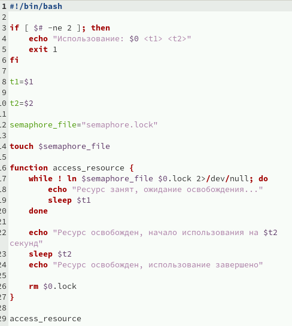

---
## Front matter
title: "Отчет по лабораторной работе № 14"
author: "Шубина София Антоновна"

## Generic otions
lang: ru-RU
toc-title: "Содержание"

## Bibliography
bibliography: bib/cite.bib
csl: pandoc/csl/gost-r-7-0-5-2008-numeric.csl

## Pdf output format
toc: true # Table of contents
toc-depth: 2
lof: true # List of figures
lot: true # List of tables
fontsize: 12pt
linestretch: 1.5
papersize: a4
documentclass: scrreprt
## I18n polyglossia
polyglossia-lang:
  name: russian
  options:
	- spelling=modern
	- babelshorthands=true
polyglossia-otherlangs:
  name: english
## I18n babel
babel-lang: russian
babel-otherlangs: english
## Fonts
mainfont: PT Serif
romanfont: PT Serif
sansfont: PT Sans
monofont: PT Mono
mainfontoptions: Ligatures=TeX
romanfontoptions: Ligatures=TeX
sansfontoptions: Ligatures=TeX,Scale=MatchLowercase
monofontoptions: Scale=MatchLowercase,Scale=0.9
## Biblatex
biblatex: true
biblio-style: "gost-numeric"
biblatexoptions:
  - parentracker=true
  - backend=biber
  - hyperref=auto
  - language=auto
  - autolang=other*
  - citestyle=gost-numeric
## Pandoc-crossref LaTeX customization
figureTitle: "Рис."
tableTitle: "Таблица"
listingTitle: "Листинг"
lofTitle: "Список иллюстраций"
lotTitle: "Список таблиц"
lolTitle: "Листинги"
## Misc options
indent: true
header-includes:
  - \usepackage{indentfirst}
  - \usepackage{float} # keep figures where there are in the text
  - \floatplacement{figure}{H} # keep figures where there are in the text
---

# Цель работы
Изучить основы программирования в оболочке ОС UNIX. Научиться писать более сложные командные файлы с использованием логических управляющих конструкций и циклов.
[@tuis_rudn]
# Выполнение лабораторной работы
1. Написать командный файл, реализующий упрощённый механизм семафоров. Ко-
мандный файл должен в течение некоторого времени t1 дожидаться освобождения
ресурса, выдавая об этом сообщение, а дождавшись его освобождения, использовать
его в течение некоторого времени t2<>t1, также выдавая информацию о том, что
ресурс используется соответствующим командным файлом (процессом). Запустить
командный файл в одном виртуальном терминале в фоновом режиме, перенаправив
его вывод в другой (> /dev/tty#, где # — номер терминала куда перенаправляется
вывод), в котором также запущен этот файл, но не фоновом, а в привилегированном
режиме. Доработать программу так, чтобы имелась возможность взаимодействия трёх
и более процессов.
(рис. [-@fig:001]).

{#fig:001 width=70%}

2. Реализовать команду man с помощью командного файла. Изучите содержимое ката-
лога /usr/share/man/man1. В нем находятся архивы текстовых файлов, содержащих
справку по большинству установленных в системе программ и команд. Каждый архив
можно открыть командой less сразу же просмотрев содержимое справки. Командный
файл должен получать в виде аргумента командной строки название команды и в виде
результата выдавать справку об этой команде или сообщение об отсутствии справки,
если соответствующего файла нет в каталоге man1.
(рис. [-@fig:002]).

{#fig:002 width=70%}
3. Используя встроенную переменную $RANDOM, напишите командный файл, генерирую-
щий случайную последовательность букв латинского алфавита. Учтите, что $RANDOM
выдаёт псевдослучайные числа в диапазоне от 0 до 32767
(рис. [-@fig:003]).

{#fig:003 width=70%}

Синтаксическая ошибка в строке:
Bash
1 while [$1 != "exit"]
Чтобы исправить ошибку, нужно добавить пробелы вокруг [ и ], и использовать команду test или двойные квадратные скобки для сравнения строк. Вот исправленный вариант:
Bash
while [ "$1" != "exit" ]
# Конкатенация нескольких строк:
В Bash можно объединить строки с помощью оператора конкатенации + или с использованием двойных кавычек. Вот примеры:

Bash

str1="Hello"
str2="World"
result=$str1$str2
echo $result
# или
result="$str1$str2"
echo $result

# Утилита seq:
seq возвращает последовательность чисел. Его функционал можно реализовать с помощью цикла for или с использованием функцональных возможностей Docker:

Bash

# Использование цикла for
for i in {1..10}; do
    echo $i
done

# Использование seq для аналогичных действий
for i in $(seq 1 10); do
    echo $i
done

# Вычисление выражения $((10/3)):
Результатом выражения $((10/3)) будет 3. Bash производит целочисленное деление, в данном случае 10 на 3 равно 3 (без остатка).

# Отличия между zsh и bash:
Отличия между zsh и bash включают в себя расширенные возможности автодополнения, более интуитивный синтаксис, улучшенное управление историей команд, встроенную поддержку индексации массивов, а также другие расширенные функции. Недостатком zsh может быть то, что он может быть менее широко поддерживаем и менее распространен, чем bash.

# Синтаксис данной конструкции цикла for:
Выражение с циклом for выглядит верным:

Bash

for ((a=1; a <= LIMIT; a++))

# Сравнение bash с другими языками программирования:
Bash является командным интерпретатором и не такой мощной язык, как Python, Java или C++. Он предназначен в основном для автоматизации задач в командной строке. Преимущества bash включают простоту использования для системного администрирования, возможность взаимодействия с системой и другими программами через командную строку. Недостатком bash является то, что он может быть менее эффективным и гибким для сложных задач, чем языки общего назначения, такие как Python или C++.
# Выводы

Я изучила основы программирования в оболочке OC UNIX.Научилась писать более сложные командные файлы с использованием логических управляющих конструкций и циклов.

# Список литературы{.unnumbered}

::: {#refs}
:::
