---
## Front matter
lang: ru-RU
title: Презентация по индивидуальному проекту (1 часть)
author:
  - Шубина С.А.
institute:
  - Российский университет дружбы народов, Москва, Россия
date: 01 марта 2024

## i18n babel
babel-lang: russian
babel-otherlangs: english

## Formatting pdf
toc: false
toc-title: Содержание
slide_level: 2
aspectratio: 169
section-titles: true
theme: metropolis
header-includes:
 - \metroset{progressbar=frametitle,sectionpage=progressbar,numbering=fraction}
 - '\makeatletter'
 - '\beamer@ignorenonframefalse'
 - '\makeatother'
## Fonts
mainfont: PT Serif
romanfont: PT Serif
sansfont: PT Sans
monofont: PT Mono
mainfontoptions: Ligatures=TeX
romanfontoptions: Ligatures=TeX
sansfontoptions: Ligatures=TeX,Scale=MatchLowercase
monofontoptions: Scale=MatchLowercase,Scale=0.9
---

# Информация

## Докладчик

:::::::::::::: {.columns align=center}
::: {.column width="70%"}

  * Шубина София Антоновна
  * Студентка НПИбд-02-23
  * факультет физико-математических и естественных найк, направление- прикладная информатика
  * Российский университет дружбы народов
  * [1132232885@pfur.ru](mailto:1132232885@pfur.ru)

:::
::::::::::::::
## Цель работы
Цель 1 части индивидуального проекта-это устаносить необходимое программное обеспечение, размещение заготовок на github для персонального сайта, скачать шаблон темы сайта, размещение его на хостинге git, установить параметр URLs для сайта, разместить загттовку на сайте для  Github pages.

## Задание
Размещение на Github pages заготовки для персонального сайта.
Установить необходимое программное обеспечение.
Скачать шаблон темы сайта.
Разместить его на хостинге git.
Установить параметр для URLs сайта.
Разместить заготовку сайта на Github pages.

## Теоретическое введение
Техническая реализация проекта
Для реализации сайта используется генератор статических сайтов Hugo.
Общие файлы для тем Wowchemy:
Репозиторий: https://github.com/wowchemy/wowchemy-hugo-themes
В качестве шаблона индивидуального сайта используется шаблон Hugo Academic Theme.
Демо-сайт: https://academic-demo.netlify.app/
Репозиторий: https://github.com/wowchemy/starter-hugo-academic

## Выполнение лабораторной работы(по пунктам)
## №1
Необходимо скачать hugo, в моем случае для Linux(ссылка дана)

{.column width="30%"}

## №2
Перемещаем в папку bin, а также необходимо разорхевировать файл hugo
Команды:sudo mv hugo /usr/local/bin -перемещение файла
tar -xvf hugo-EXTENDED-0.121.1-Linux-64bit.tar.gz-разорхевация файла

{.column width="30%"}

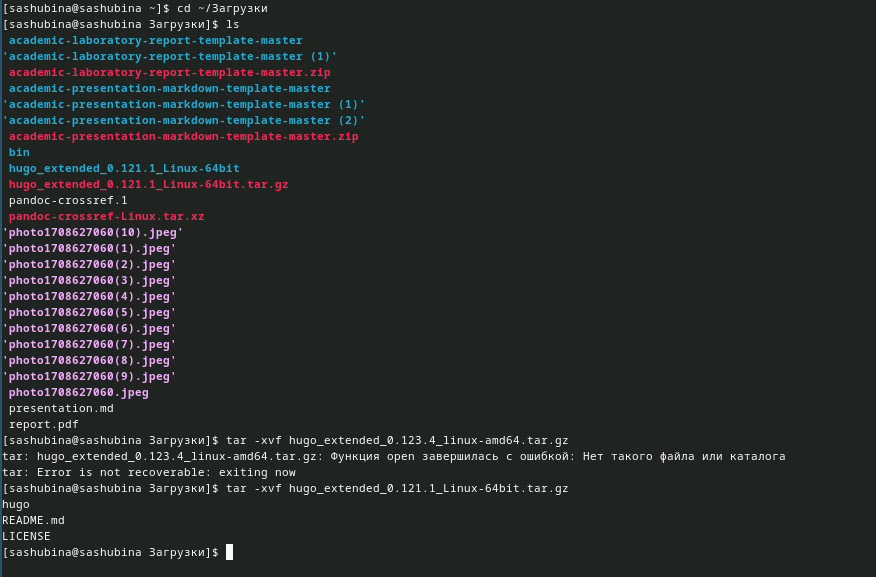{.column width="30%"}

## №3
На всякий случай перепроверяем нахождение файла в папке
ls /usr/local/bin

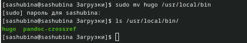{.column width="30%"}

## №4
Создаем новый репозиторий на Github

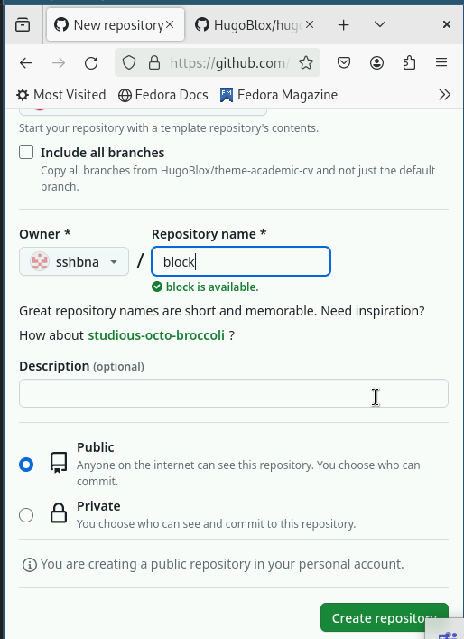{.column width="30%"}

## №5
Копируем (ссылкой на репозиторий) в папку block("там будет храниться наш сайт")
Команда: git clone --recursive ссылка на репозиторий

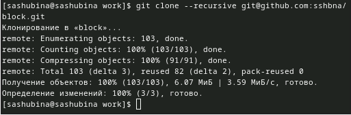{.column width="30%"}

## №6
Просматриваем папку block
Команда:ls

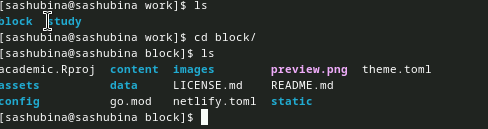{.column width="30%"}

## №7
Перед тем как зайти на сервер, надо скачать go
команда: sudo dnf install go

{.column width="30%"}

## №8
Запускаем сервер
Команда: hugo server

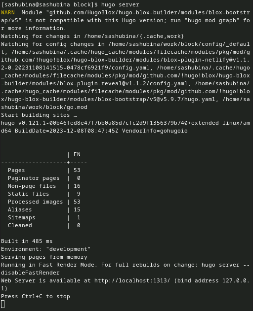{.column width="30%"}

## №9
http://localhost:1313/-это ссылка на мой сайт,которую необходимо перенести в браузер, чтобы открыть сайт

{.column width="30%"}

## №10
Создаем новый репозиторий на Github sshbna.github.io-в моем случае

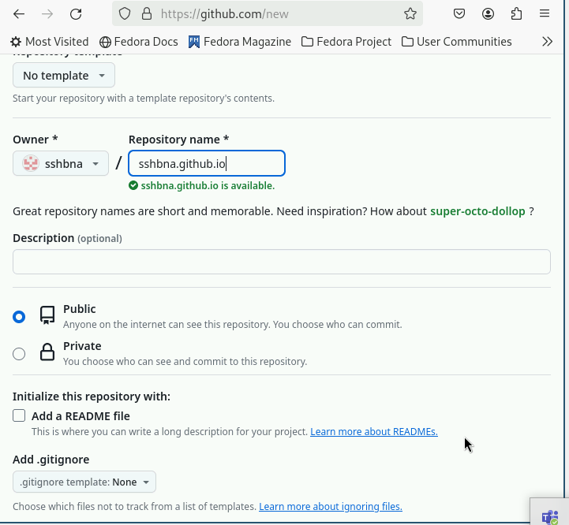{.column width="30%"}

## №11
Клонируем репозиторий
Команда: git clone --recursive ссылка на репозиторий

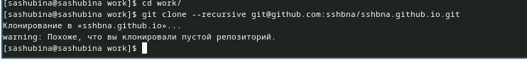{.column width="30%"}

## №12
Просматриваем папку и переключается на ветку main
Команды: ls-просмотр
git checkout -b main-переключение на ветку main

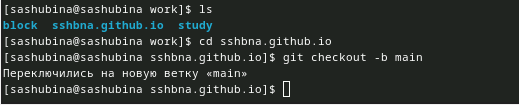{.column width="30%"}

## №13
Создаем файл README.md
Команда: touch

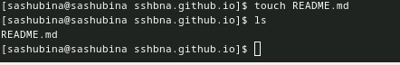{.column width="30%"}

## №14
Отправляем файл на Github
Командами:
git add .
git commit -am "Пояснение действия"
git push

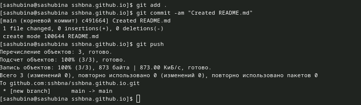{.column width="30%"}

## №15
Командой git submodule add -b main ссылка мы добавляем подрепозиторий

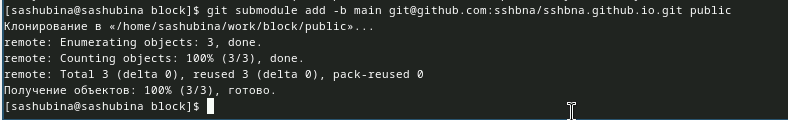{.column width="30%"}
## №16
Отправляем все на Github
Командами:
git add .
git commit -am "Пояснение действия"
git push
На всякий случай можно прописать ветку

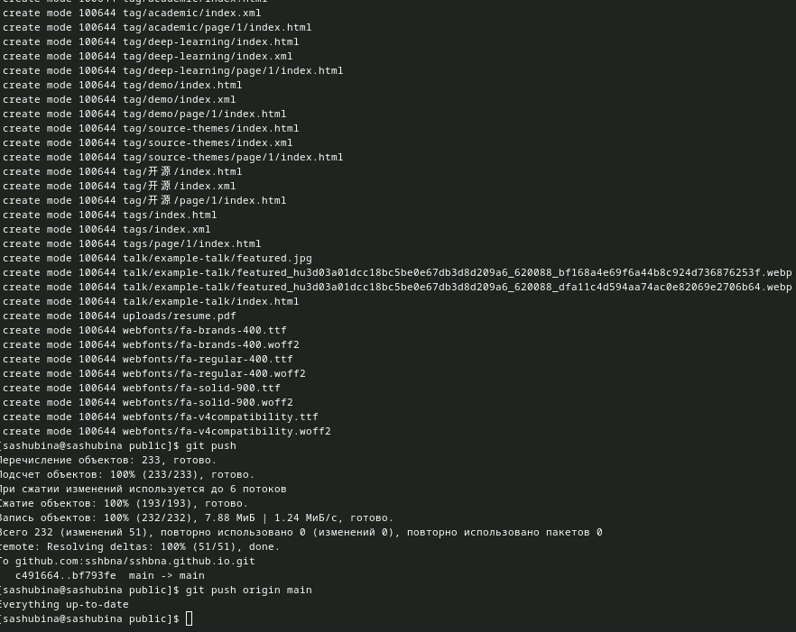{.column width="30%"}

## №17
Просмотр папок и файлов в репозитории

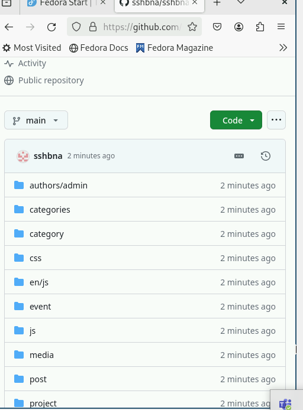{.column width="30%"}

## Выводы

Я разместила на Github pages заготовки для персонального сайта, установила необходимое программное обеспечение, скачала шаблон темы сайта, разместила его на хостинге git, установила параметтр для URLs сайта, разместила заготовку сайта на Github pages.
## Спасибо за внимание!

:::

