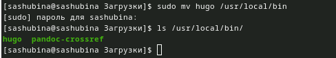
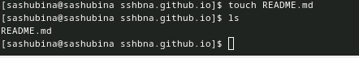

---
## Front matter
title: "Отчет по индивидуальному проекту(часть 1)"
author: "Шубина София Антоновна"

## Generic otions
lang: ru-RU
toc-title: "Содержание"

## Bibliography
bibliography: bib/cite.bib
csl: pandoc/csl/gost-r-7-0-5-2008-numeric.csl

## Pdf output format
toc: true # Table of contents
toc-depth: 2
lof: true # List of figures
lot: true # List of tables
fontsize: 12pt
linestretch: 1.5
papersize: a4
documentclass: scrreprt
## I18n polyglossia
polyglossia-lang:
  name: russian
  options:
	- spelling=modern
	- babelshorthands=true
polyglossia-otherlangs:
  name: english
## I18n babel
babel-lang: russian
babel-otherlangs: english
## Fonts
mainfont: PT Serif
romanfont: PT Serif
sansfont: PT Sans
monofont: PT Mono
mainfontoptions: Ligatures=TeX
romanfontoptions: Ligatures=TeX
sansfontoptions: Ligatures=TeX,Scale=MatchLowercase
monofontoptions: Scale=MatchLowercase,Scale=0.9
## Biblatex
biblatex: true
biblio-style: "gost-numeric"
biblatexoptions:
  - parentracker=true
  - backend=biber
  - hyperref=auto
  - language=auto
  - autolang=other*
  - citestyle=gost-numeric
## Pandoc-crossref LaTeX customization
figureTitle: "Рис."
tableTitle: "Таблица"
listingTitle: "Листинг"
lofTitle: "Список иллюстраций"
lotTitle: "Список таблиц"
lolTitle: "Листинги"
## Misc options
indent: true
header-includes:
  - \usepackage{indentfirst}
  - \usepackage{float} # keep figures where there are in the text
  - \floatplacement{figure}{H} # keep figures where there are in the text
---

# Цель работы
Цель 1 части индивидуального проекта-это устаносить необходимое программное обеспечение, размещение заготовок на github для персонального сайта, скачать шаблон темы сайта, размещение его на хостинге git, установить параметр URLs для сайта, разместить загттовку на сайте для  Github pages.

# Задание
Размещение на Github pages заготовки для персонального сайта.
Установить необходимое программное обеспечение.
Скачать шаблон темы сайта.
Разместить его на хостинге git.
Установить параметр для URLs сайта.
Разместить заготовку сайта на Github pages.
[@tuis_rudn]
# Теоретическое введение
Техническая реализация проекта
Для реализации сайта используется генератор статических сайтов Hugo.
Общие файлы для тем Wowchemy:
Репозиторий: https://github.com/wowchemy/wowchemy-hugo-themes
В качестве шаблона индивидуального сайта используется шаблон Hugo Academic Theme.
Демо-сайт: https://academic-demo.netlify.app/
Репозиторий: https://github.com/wowchemy/starter-hugo-academic
[@tuis_rudn]
# Выполнение лабораторной работы
1) Необходимо скачать hugo, в моем случае для Linux(ссылка дана)
(рис. [-@fig:001]).

{#fig:001 width=70%}

2)Перемещаем в папку bin, а также необходимо разорхевировать файл hugo
Команды:sudo mv hugo /usr/local/bin -перемещение файла
tar -xvf hugo-EXTENDED-0.121.1-Linux-64bit.tar.gz-разорхевация файла
(рис. [-@fig:002],[-@fig:003]).

{#fig:002 width=70%}

{#fig:003 width=70%}

3)На всякий случай перепроверяем нахождение файла в папке
ls /usr/local/bin
(рис. [-@fig:004]).

{#fig:004 width=70%}

4)Создаем новый репозиторий на Github
(рис. [-@fig:005]).

{#fig:005 width=70%}

5)Копируем (ссылкой на репозиторий) в папку block("там будет храниться наш сайт")
Команда: git clone --recursive ссылка на репозиторий
(рис. [-@fig:006]).

{#fig:006 width=70%}

6)Просматриваем папку block
Команда:ls
(рис. [-@fig:007]).

{#fig:007 width=70%}

7)Перед тем как зайти на сервер, надо скачать go
команда: sudo dnf install go
(рис. [-@fig:008]).

{#fig:008 width=70%}

8)Запускаем сервер
Команда: hugo server
(рис. [-@fig:009]).

{#fig:009 width=70%}

9)http://localhost:1313/-это ссылка на мой сайт,которую необходимо перенести в браузер, чтобы открыть сайт
(рис. [-@fig:010]).

{#fig:010 width=70%}

10) Создаем новый репозиторий на Github sshbna.github.io-в моем случае
(рис. [-@fig:011]).

{#fig:011 width=70%}

11)Клонируем репозиторий
Команда: git clone --recursive ссылка на репозиторий
(рис. [-@fig:012]).

{#fig:012 width=70%}

12)Просматриваем папку и переключается на ветку main
Команды: ls-просмотр
git checkout -b main-переключение на ветку main
(рис. [-@fig:013]).

{#fig:013 width=70%}

13)Создаем файл README.md
Команда: touch
(рис. [-@fig:014]).

{#fig:014 width=70%}

14)Отправляем файл на Github
Командами:
git add .
git commit -am "Пояснение действия"
git push
(рис. [-@fig:015]).

{#fig:015 width=70%}

15) Командой git submodule add -b main ссылка мы добавляем подрепозиторий
(рис. [-@fig:016]).

{#fig:016 width=70%}

16)Отправляем все на Github
Командами:
git add .
git commit -am "Пояснение действия"
git push
На всякий случай можно прописать ветку
(рис. [-@fig:017]).

{#fig:017 width=70%}

17)Просмотр папок и файлов в репозитории
(рис. [-@fig:018]).

{#fig:018 width=70%}

# Выводы

Я разместила на Github pages заготовки для персонального сайта, установила необходимое программное обеспечение, скачала шаблон темы сайта, разместила его на хостинге git, установила параметтр для URLs сайта, разместила заготовку сайта на Github pages.

# Список литературы{.unnumbered}

::: {#refs}
:::
