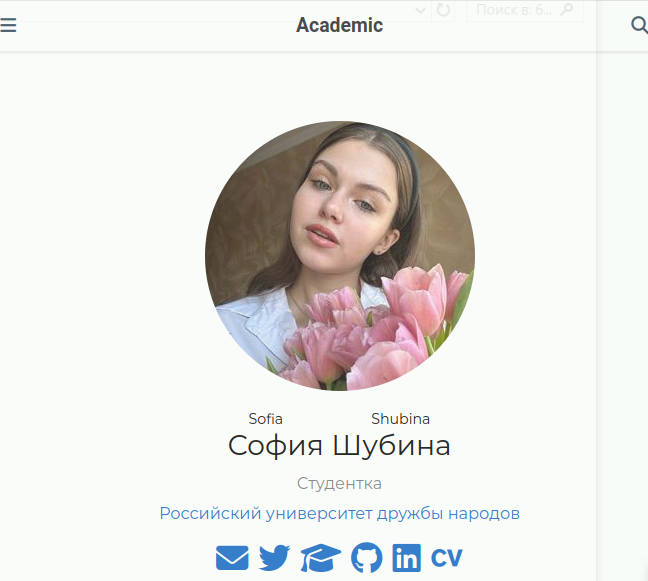
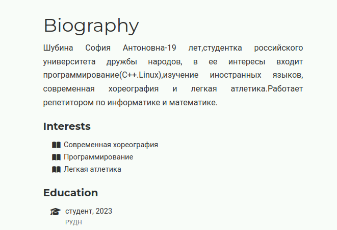
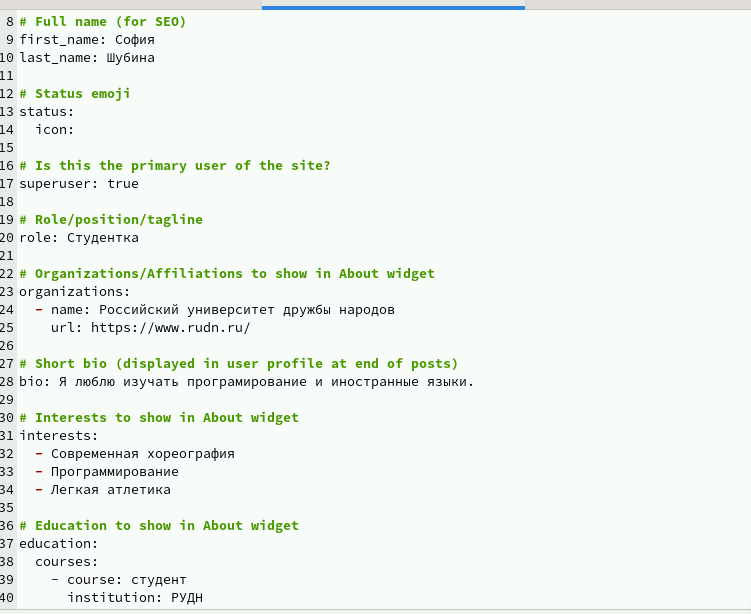
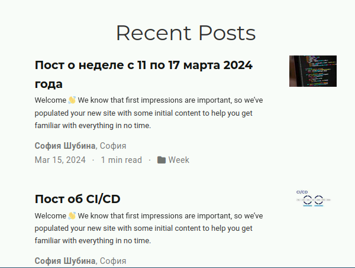
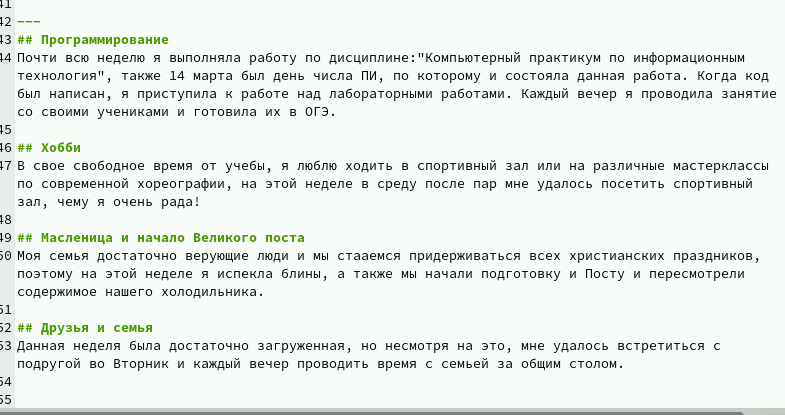
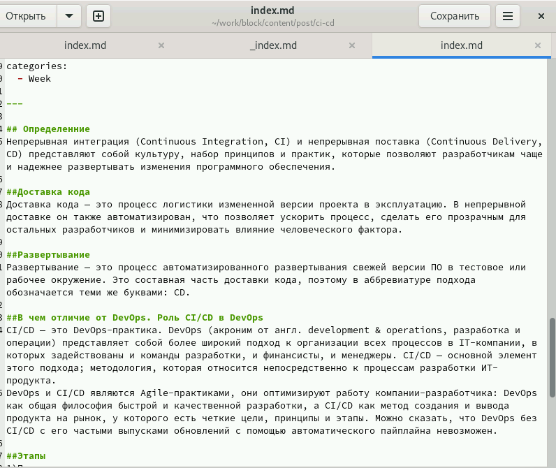

---
## Front matter
lang: ru-RU
title: Презентация ко 2 части индивидуального проекта
author:
  - Шубина С.А.
institute:
  - Российский университет дружбы народов, Москва, Россия

date: 16 марта 2024

## i18n babel
babel-lang: russian
babel-otherlangs: english

## Formatting pdf
toc: false
toc-title: Содержание
slide_level: 2
aspectratio: 169
section-titles: true
theme: metropolis
header-includes:
 - \metroset{progressbar=frametitle,sectionpage=progressbar,numbering=fraction}
 - '\makeatletter'
 - '\beamer@ignorenonframefalse'
 - '\makeatother'
## Fonts
mainfont: PT Serif
romanfont: PT Serif
sansfont: PT Sans
monofont: PT Mono
mainfontoptions: Ligatures=TeX
romanfontoptions: Ligatures=TeX
sansfontoptions: Ligatures=TeX,Scale=MatchLowercase
monofontoptions: Scale=MatchLowercase,Scale
---

# Информация

## Докладчик

:::::::::::::: {.columns align=center}
::: {.column width="70%"}

  * Шубина София Антоновна
  * Студентка
  * Факультет физико-математических и ествественных наук, направление-пракладная информатика
  * Российский университет дружбы народов
  * [1132232885@pfur.ru](mailto:1132232885@pfur.ru)

::::::::::::::

## Цель работы
Добавить к сайту данные о себе 

## Задание
Список добавляемых данных.
Разместить фотографию владельца сайта.
Разместить краткое описание владельца сайта (Biography).
Добавить информацию об интересах (Interests).
Добавить информацию от образовании (Education).
Сделать пост по прошедшей неделе.
Добавить пост на тему по выбору:
Управление версиями. Git.
Непрерывная интеграция и непрерывное развертывание (CI/CD).

## Выполнение лабораторной работы
## 1)Для начала надо добавить свою фотографию для сайта
/home/sashubina/work/block/content/authors/admin
c названием avatar.jpg
 (рис. [-@fig:001]).

{#fig:001 width=70%}

## 2)Далее размещаем краткое описание владельца сайта
(рис. [-@fig:002],[-@fig:003]).

{#fig:002 width=70%}

{#fig:003 width=70%}

## 3)Добавить информацию об интересах
(рис. [-@fig:004]).

{#fig:004 width=70%}

## 4)Добавить информацию об образовании
(рис. [-@fig:005]).

{#fig:005 width=70%}
 
## 5)Добавить пост по прошедшей неделе
(рис. [-@fig:006],[-@fig:007]).

{#fig:006 width=70%}

{#fig:007 width=70%}

## 6)Добавить пост на тему по выбору, я выбрала Непрерывная интеграция и непрерывное развертывание (CI/CD)
(рис. [-@fig:008]).

{#fig:008 width=70%}
## Выводы

Я добавила к сайту данные о себе

